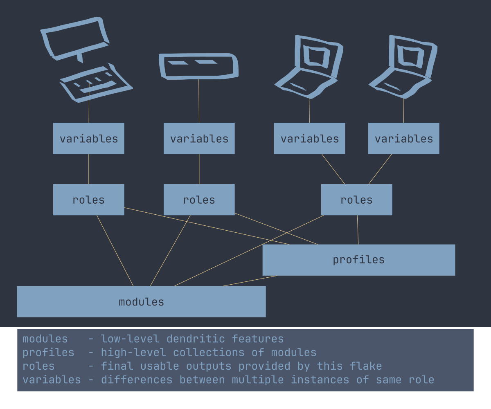

<h1 align="center">NixOS Configuration Flake</h1>
<p align="center" style="font-size: 0.3rem;">
    <a href="#features">Features</a> &bull;
    <a href="#configuration-roles">Configuration Roles</a> &bull;
    <a href="#bootstrap-images">Bootstrap Images</a> &bull;
    <a href="#bespoke-cli">Bespoke CLI</a> &bull;
    <a href="#architecture">Architecture</a> &bull;
    <a href="#related-flakes">Related Flakes</a>
</p>


~~slightly overengineered~~ NixOS configuration flake for multiple hosts with
ZFS, Impermanence, MicroVMs, WireGuard, etc

# Features

[Why do I not use some popular libraries?](./doc/why-not-x.md)

[Security Features](./doc/security.md)

Nix-specific features:

- Completely reproducible, pure evaluation
- Role-based outputs with features as modules
- Variables system for device-specific configuration
- [Bespoke CLI](#bespoke-cli) for maintaining this flake
- Flake-enabled [bootstrap images](#bootstrap-images)
- Dotfiles managed using wrappers implemented from basic nixpkgs functions
- [Impermanence](./doc/filesystems.md#impermanence) using ZFS snapshots and bind
  mounts, without the library
- Service isolation using
  [microvm.nix](https://github.com/microvm-nix/microvm.nix)
- Secrets managed using [sops-nix](https://github.com/Mic92/sops-nix)
- Secure boot using [lanzaboote](https://github.com/nix-community/lanzaboote)
- Package management using [Lix](https://lix.systems)

Desktop features:

- 100% wayland, no xorg or xwayland
- [SwayFX](https://github.com/WillPower3309/swayfx) compositor
- [Waybar](https://github.com/Alexays/Waybar) top panel with several useful
  modules
- [Eww](https://github.com/elkowar/eww) widgets for bottom dock, dashboard,
  calendar, etc
- [Rofi](https://github.com/davatorium/rofi) menu for launchers, clipboard
  history, workspace switchers, etc
- [Brave](https://github.com/brave/brave-browser/) browser with tight policies.
- Sandboxing with [Bubblewrap](https://github.com/containers/bubblewrap) and
  [xdg-dbus-proxy](https://github.com/flatpak/xdg-dbus-proxy).
- NVF-powered [neovim](https://github.com/sotormd/neovim) configuration
- Theming and colors with [colors](https://github.com/sotormd/colors)
- Declarative browser homepage with
  [homepage](https://github.com/sotormd/homepage)
- Declarative wallpapers with
  [wallpapers](https://github.com/sotormd/wallpapers)
- XKCD lockscreen wallpapers with
  [xkcd-wall](https://github.com/sotormd/xkcd-wall)
- Automatic behavior changes when outside trusted & reliable networks with
  [Roaming Mode](./doc/laptop/usage.md#roaming-mode)

Services features:

- MicroVM services
- WireGuard tunnelling
- nftables firewall
- [Unbound](https://github.com/NLnetLabs/unbound) dns server
- [NGINX](https://github.com/nginx/nginx) web server & reverse proxy
- ACME for [Let's Encrypt](https://letsencrypt.org/) certificates
- [SearXNG](https://github.com/searxng/searxng) search engine
- [Vaultwarden](https://github.com/dani-garcia/vaultwarden) password manager
- [i2pd](https://github.com/PurpleI2P/i2pd) I2P router

<details>

<summary>Click to expand: Comprehensive features list</summary>

| Category                      | Stack                                                                                                      |
| ----------------------------- | ---------------------------------------------------------------------------------------------------------- |
| distro                        | `NixOS`                                                                                                    |
| packages                      | `nixos-unstable`                                                                                           |
| package manager               | `lix`                                                                                                      |
| kernel                        | `linux`                                                                                                    |
| shell                         | `bash`                                                                                                     |
| malloc                        | `graphene-hardened`                                                                                        |
| bootloader                    | `systemd-boot`, `uboot`                                                                                    |
| secure boot                   | `lanzaboote`                                                                                               |
| filesystem                    | `zfs`                                                                                                      |
| impermanence                  | `zfs(8)` `mount(8)`                                                                                        |
| drive health                  | `smartmontools`                                                                                            |
| dotfiles                      | `nixpkgs` wrappers                                                                                         |
| ~ symlinks                    | `systemd-tmpfiles`                                                                                         |
| auditing                      | `auditd`                                                                                                   |
| secrets                       | `sops`, `sops-nix`                                                                                         |
| keys                          | `age`, `signify`, `gpg`                                                                                    |
| usb policy                    | `usbguard`                                                                                                 |
| sandboxing                    | `bubblewrap`, `xdg-dbus-proxy`                                                                             |
| firewall                      | `nftables`                                                                                                 |
| mac randomization             | `macchanger`                                                                                               |
| anonymity                     | `i2pd`                                                                                                     |
| networking                    | `systemd-networkd`                                                                                         |
| tunnelling                    | `wireguard`                                                                                                |
| wireless                      | `wpa_supplicant`                                                                                           |
| dns                           | `unbound`                                                                                                  |
| secure shell                  | `sshd`, `fail2ban`                                                                                         |
| display server                | `wayland`                                                                                                  |
| compositor                    | `swayfx`, `cage`                                                                                           |
| bar                           | `waybar`                                                                                                   |
| widgets                       | `eww`                                                                                                      |
| launcher                      | `rofi`                                                                                                     |
| notifications                 | `dunst`                                                                                                    |
| terminal emulator             | `foot`                                                                                                     |
| file manager                  | `thunar`                                                                                                   |
| audio                         | `pipewire`, `pavucontrol`, `playerctl`                                                                     |
| media player                  | `mpv`                                                                                                      |
| pdf reader                    | `zathura`                                                                                                  |
| images                        | `swayimg`                                                                                                  |
| vector graphics editor        | `inkscape`                                                                                                 |
| screenshots                   | `grimshot`, `grim`, `slurp`                                                                                |
| clipboard                     | `cliphist`                                                                                                 |
| browser                       | `brave`                                                                                                    |
| web server                    | `nginx`                                                                                                    |
| certificates                  | `acme`                                                                                                     |
| homepage                      | [`homepage`](https://github.com/sotormd/homepage)                                                          |
| search engine                 | `searxng`                                                                                                  |
| bittorrent                    | `qbittorrent-nox`                                                                                          |
| passwords                     | `vaultwarden`                                                                                              |
| text editor                   | [`neovim`](https://github.com/sotormd/neovim), `mousepad`                                                  |
| version control               | `git`                                                                                                      |
| development                   | `rust`, `python`, `go`, `haskell`                                                                          |
| virtualization                | `microvm.nix`, `qemu`, `virt-manager`, `distrobox`, `podman`                                               |
| cpu optimizations             | `auto-cpufreq`                                                                                             |
| resource monitor              | `htop`                                                                                                     |
| themes, icons, cursors, fonts | [`colors`](https://github.com/sotormd/colors)                                                              |
| wallpapers                    | [`wallpapers`](https://github.com/sotormd/wallpapers), [`xkcd-wall`](https://github.com/sotormd/xkcd-wall) |

</details>

# Configuration Roles

This flake uses role-based configuration.

| Role   | Description                        | Documentation                                                                                                  |
| ------ | ---------------------------------- | -------------------------------------------------------------------------------------------------------------- |
| Laptop | Configuration for my laptops.      | [Requirements](./doc/laptop/requirements.md) - [Setup](./doc/laptop/setup.md) - [Usage](./doc/laptop/usage.md) |
| Server | Configuration for my home-servers. | [Requirements](./doc/server/requirements.md) - [Setup](./doc/server/setup.md) - [Usage](./doc/server/usage.md) |

Some previous roles have been moved to separate repos, see
[Related Flakes](#related-flakes).

# Bootstrap Images

Four images: MATE, GNOME, Minimal and SD are included (for installation,
recovery, etc.)

These images provide a preconfigured environment for setting up this flake, and
include useful tools for installation, recovery, etc.

It is also possible to further configure these images for specific installation
setups. Modules for remote installation over a wireless network are also
provided.

See [Images Documentation](./doc/images.md) for more details.

# Bespoke CLI

Routine tasks such as updating the flake, switching configurations,
garbage-collecting, and editing variables & secrets are handled through the
bespoke unified `nixos(1)` wrapper CLI.

Manpage:

```bash
man nixos
```

See [CLI Documentation](./doc/cli.md) for the full command reference and
workflow examples.

# Architecture



- [`./modules/`](./modules) are low-level features, which are exposed under
  `nixosModules.modules.*`.
- [`./profiles/`](./profiles) are high-level collections of modules, which are
  exposed under `nixosModules.profiles.*`.
- [`./roles/`](./roles) are the final outputs provided by this flake, each role
  is a full system configuration composed of several profiles/modules.
- Variables capture the differences between multiple instances of the same role.
  Variables are not provided in this flake and are defined on a per-deployment
  basis.

# Related Flakes

Here are some of my other flakes that are related to my NixOS tooling:

- [neovim](https://github.com/sotormd/neovim), Neovim configuration flake (ft.
  nvf)
- [neovim-nixvim](https://github.com/sotormd/neovim-nixvim), Neovim
  configuration flake (ft. nixvim)
- [colors](https://github.com/sotormd/colors), Colorscheme flake
- [wallpapers](https://github.com/sotormd/wallpapers), Expose wallpapers as Nix
  expressions
- [homepage](https://github.com/sotormd/homepage), A pure Nix static homepage
  generator
- [droid](https://github.com/sotormd/droid), nix-on-droid configuration
- [pattern](https://github.com/sotormd/pattern), Atomic, image-based systems
  with A/B updates, provisioned using Nix
- [polevault](https://github.com/sotormd/polevault), A
  [pattern](https://github.com/sotormd/pattern) to access backup vaultwarden
  vaults when away from main server
- [flag](https://github.com/sotormd/flag), A
  [pattern](https://github.com/sotormd/pattern) for my VMs
- [nate](https://github.com/sotormd/nate), MATE desktop for my NixOS needs
- [coffee](https://github.com/sotormd/coffee), A very minimal openbox
  configuration

Some of these repos were previously part of this repo, but separated due to
being out-of-scope (eg, [pattern](https://github.com/sotormd/pattern)).

Others are still in-scope, but are maintained separately for simplicity (eg,
[wallpapers](https://github.com/sotormd/wallpapers)).
