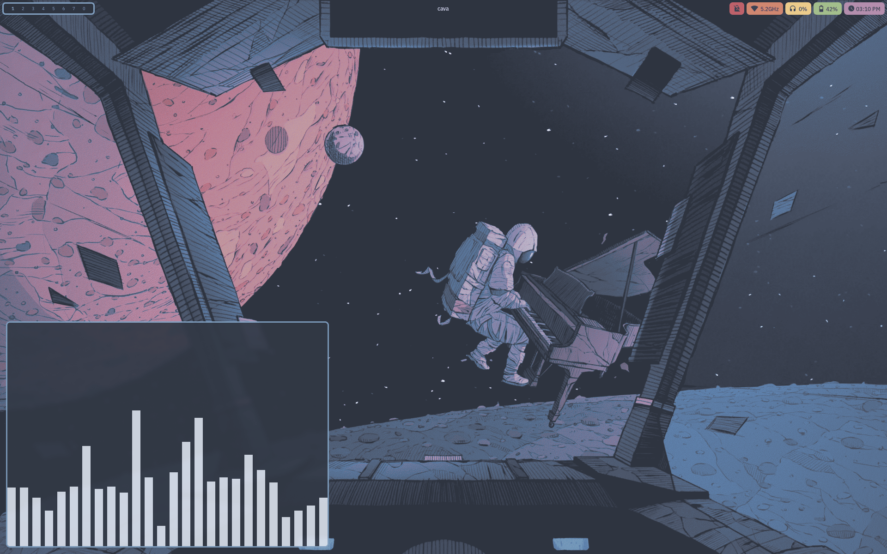

<p align="center" style="display: flex; align-items: center; justify-content: center; gap: 10px;">
  <h1 align="center">NixOS Configuration Flake</h1>
  <p align="center" style="font-size: 0.3rem;">
    <strong>
      <a href="#features">Features</a> |
      <a href="#roles">Roles</a> |
      <a href="#images">Images</a> |
      <a href="#cli">CLI</a> |
      <a href="#related">Related</a>
    </strong>
  </p>
</p>



~~slighly overengineered~~ NixOS configuration flake for multiple hosts

# Features

[Why do I not use some popular libraries?](./doc/why-not-x.md)

[Security Features](./doc/security.md)

Nix-specific features:

- Completely reproducible, pure evaluation
- Dotfiles managed using wrappers implemented from basic nixpkgs functions
- Symlinks in ~ managed using [hjem](https://github.com/feel-co/hjem)
- Secrets managed using [sops-nix](https://github.com/Mic92/sops-nix)
- Secure boot using [lanzaboote](https://github.com/nix-community/lanzaboote)
- [Impermanence](./doc/filesystems.md#impermanence) using ZFS snapshots and bind
  mounts, without the library.
- Package management using [lix](https://lix.systems)
- Role-based modules
- Variables system for device-specific configuration
- Flake helper [CLI](#cli)
- Flake-enabled installation [images](#images)

Desktop features:

- 100% wayland, no xorg or xwayland
- [SwayFX](https://github.com/WillPower3309/swayfx) compositor
- [Waybar](https://github.com/Alexays/Waybar) top panel with several useful
  modules
- [Eww](https://github.com/elkowar/eww) widgets for bottom dock, dashboard,
  calendar, etc
- [Rofi](https://github.com/davatorium/rofi) menu for launchers, clipboard
  history, workspace switchers, etc
- [Brave](https://github.com/brave/brave-browser/) browser with tight policies
  to ensure security and protect user privacy
- Sandboxing with [Bubblewrap](https://github.com/containers/bubblewrap) and
  [xdg-dbus-proxy](https://github.com/flatpak/xdg-dbus-proxy).
- NVF-powered [neovim](https://github.com/sotormd/neovim) configuration
- Theming and colors with [colors](https://github.com/sotormd/colors)
- Declarative browser homepage with
  [homepage](https://github.com/sotormd/homepage)
- Declarative wallpapers with
  [wallpapers](https://github.com/sotormd/wallpapers)
- XKCD lockscreen wallpapers with
  [xkcd-wall](https://github.com/sotormd/xkcd-wall)
- Automatic behavior changes when outside trusted & reliable networks with
  [Roaming Mode](./doc/laptop/usage.md#roaming-mode)

Services features:

- [Unbound](https://github.com/NLnetLabs/unbound) dns server
- [NGINX](https://github.com/nginx/nginx) web server & reverse proxy
- ACME for [Let's Encrypt](https://letsencrypt.org/) certificates
- [SearXNG](https://github.com/searxng/searxng) search engine
- [Vaultwarden](https://github.com/dani-garcia/vaultwarden) password manager
- [i2pd](https://github.com/PurpleI2P/i2pd) I2P router
- [Jellyfin](https://jellyfin.org/) media server

Comprehensive features list:

| Category                      | Stack                                                                                                      |
| ----------------------------- | ---------------------------------------------------------------------------------------------------------- |
| distro                        | `NixOS`                                                                                                    |
| packages                      | `nixos-unstable`                                                                                           |
| package manager               | `lix`                                                                                                      |
| kernel                        | `linux`                                                                                                    |
| shell                         | `bash`                                                                                                     |
| entropy                       | `jitterentropy`                                                                                            |
| malloc                        | `graphene-hardened`                                                                                        |
| bootloader                    | `systemd-boot`, `uboot`                                                                                    |
| secure boot                   | `lanzaboote`                                                                                               |
| filesystem                    | `zfs`                                                                                                      |
| impermanence                  | `zfs(8)` `mount(8)`                                                                                        |
| drive health                  | `smartmontools`                                                                                            |
| ~ symlinks                    | `hjem`                                                                                                     |
| dotfiles                      | `nixpkgs` wrappers                                                                                         |
| auditing                      | `auditd`                                                                                                   |
| secrets                       | `sops`, `sops-nix`                                                                                         |
| usb policy                    | `usbguard`                                                                                                 |
| sandboxing                    | `bubblewrap`, `xdg-dbus-proxy`                                                                             |
| firewall                      | `nf_tables`                                                                                                |
| mac randomization             | `macchanger`                                                                                               |
| anonymity                     | `i2pd`, `mat2`                                                                                             |
| networking                    | `wpa_supplicant`                                                                                           |
| dns                           | `unbound`                                                                                                  |
| secure shell                  | `sshd`, `fail2ban`                                                                                         |
| display server                | `wayland`                                                                                                  |
| compositor                    | `swayfx`, `cage`                                                                                           |
| bar                           | `waybar`                                                                                                   |
| widgets                       | `eww`                                                                                                      |
| launcher                      | `rofi`                                                                                                     |
| notifications                 | `dunst`                                                                                                    |
| terminal emulator             | `foot`                                                                                                     |
| file manager                  | `thunar`                                                                                                   |
| audio                         | `pipewire`, `pavucontrol`, `playerctl`                                                                     |
| media player                  | `mpv`                                                                                                      |
| pdf reader                    | `zathura`                                                                                                  |
| images                        | `swayimg`, `imagemagick`                                                                                   |
| vector graphics editor        | `inkscape`                                                                                                 |
| screenshots                   | `grimshot`, `grim`, `slurp`                                                                                |
| clipboard                     | `cliphist`                                                                                                 |
| browser                       | `brave`                                                                                                    |
| web server                    | `nginx`                                                                                                    |
| certificates                  | `acme`                                                                                                     |
| homepage                      | [`homepage`](https://github.com/sotormd/homepage)                                                          |
| search engine                 | `searxng`                                                                                                  |
| media server                  | `jellyfin`                                                                                                 |
| bittorrent                    | `qbittorrent-nox`                                                                                          |
| passwords                     | `vaultwarden`                                                                                              |
| text editor                   | [`neovim`](https://github.com/sotormd/neovim), `mousepad`                                                  |
| version control               | `git`                                                                                                      |
| development                   | `rust`, `python`, `go`, `haskell`                                                                          |
| virtualization                | `qemu`, `virt-manager`, `distrobox`, `podman`                                                              |
| cpu optimizations             | `auto-cpufreq`                                                                                             |
| resource monitor              | `btop`, `htop`                                                                                             |
| themes, icons, cursors, fonts | [`colors`](https://github.com/sotormd/colors)                                                              |
| wallpapers                    | [`wallpapers`](https://github.com/sotormd/wallpapers), [`xkcd-wall`](https://github.com/sotormd/xkcd-wall) |
| terminal misc                 | `cava`, `fortune`                                                                                          |

# Roles

This flake uses role-based configuration.

| Role   | Description                         | Documentation                                                                                                                                |
| ------ | ----------------------------------- | -------------------------------------------------------------------------------------------------------------------------------------------- |
| Laptop | Personal laptop configuration.      | [Requirements](./doc/laptop/requirements.md)<br>[Setup Documentation](./doc/laptop/setup.md)<br>[Usage Documentation](./doc/laptop/usage.md) |
| Server | Headless home-server configuration. | [Requirements](./doc/server/requirements.md)<br>[Setup Documentation](./doc/server/setup.md)<br>[Usage Documentation](./doc/server/usage.md) |

Some previous roles have been moved to separate repos, see [Related](#related).

# Images

[](https://github.com/sotormd/nixos/actions/workflows/build-gnome-iso.yml)

[](https://github.com/sotormd/nixos/actions/workflows/build-minimal-iso.yml)

Three images: GNOME, Minimal and SD are included (for installation, recovery,
etc.)

These images have an ideal environment for bootstrapping and installing this
flake.

It is also possible to further configure these images for specific installation
setups. Modules for remote installation over a wireless network are also
provided.

See [Images Documentation](./doc/images.md) for more details.

# CLI

Routine tasks such as updating the flake, switching configurations,
garbage-collecting, and editing variables & secrets are handled through the
bespoke unified `nixos(1)` wrapper CLI.

Manpage:

```bash
man nixos
```

See [CLI Documentation](./doc/cli.md) for the full command reference and
workflow examples.

# Related

Here are some of my other repos that are related to my NixOS tooling:

- [neovim](https://github.com/sotormd/neovim), Neovim configuration flake (ft.
  nvf)
- [neovim-nixvim](https://github.com/sotormd/neovim-nixvim), Neovim
  configuration flake (ft. nixvim)
- [colors](https://github.com/sotormd/colors), Colorscheme flake
- [wallpapers](https://github.com/sotormd/wallpapers), Expose wallpapers as Nix
  expressions
- [homepage](https://github.com/sotormd/homepage), A pure Nix static homepage
  generator
- [droid](https://github.com/sotormd/droid), nix-on-droid configuration
- [pattern](https://github.com/sotormd/pattern), Atomic, image-based systems
  with A/B updates, provisioned using Nix
- [flag](https://github.com/sotormd/flag), A
  [pattern](https://github.com/sotormd/pattern) for my VMs
- [nate](https://github.com/sotormd/nate), MATE desktop for my NixOS needs
- [coffee](https://github.com/sotormd/coffee), A very minimal openbox
  configuration

Some of these repos were previously part of this repo, but separated due to
being out-of-scope (eg, [pattern](https://github.com/sotormd/pattern)).

Others are still in-scope, but are maintained separately for simplicity (eg,
[wallpapers](https://github.com/sotormd/wallpapers)).
