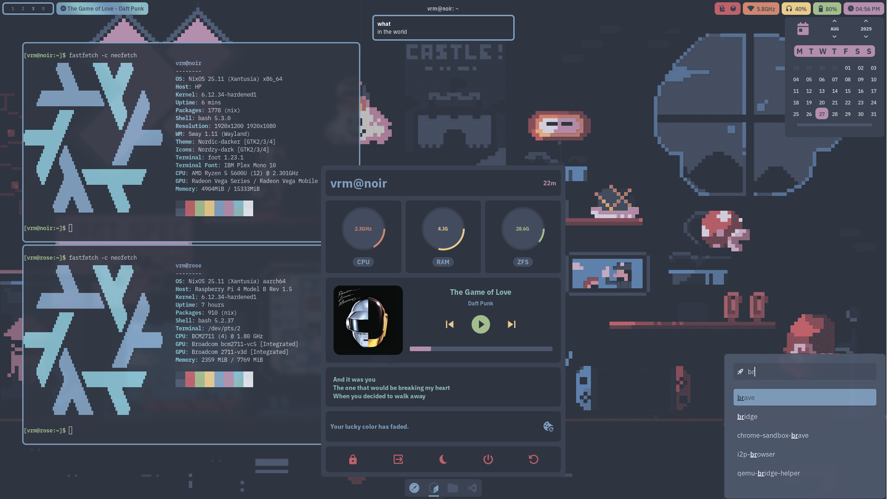

# NixOS Configuration Flake

NixOS configuration flake for multiple hosts.

# Features

|                   |                                                                                     |
|-------------------|-------------------------------------------------------------------------------------|
| distro            | `NixOS`                                                                             |
| packages          | `nixos-unstable`                                                                    |
| package manager   | `lix`                                                                               |
| secrets           | `sops-nix` `sops`                                                                   |
| bootloader        | `systemd-boot` `uboot`                                                              |
| secureboot        | `lanzaboote`                                                                        |
| kernel            | `linux-hardened`                                                                    |
| auditing          | `auditd`                                                                            |
| shell             | `bash`                                                                              |
| filesystem        | `zfs`                                                                               |
| networking        | `wpa_supplicant`                                                                    |
| dns               | `unbound`                                                                           |
| audio             | `pipewire` `pulseaudio`                                                             |
| web server        | `nginx`                                                                             |
| media server      | `jellyfin`                                                                          |
| display server    | `wayland`                                                                           |
| compositor        | `swayfx`                                                                            |
| bar               | `waybar`                                                                            |
| widgets           | `eww`                                                                               |
| launcher          | `rofi`                                                                              |
| notifications     | `dunst`                                                                             |
| terminal emulator | `foot`                                                                              |
| file manager      | `thunar`                                                                            |
| pdf reader        | `zathura`                                                                           |
| image viewer      | `swayimg`                                                                           |
| media player      | `mpv`                                                                               |
| browser           | `brave`                                                                             |
| search engine     | `searxng`                                                                           |
| anonymity         | `i2pd` `oniux`                                                                      |
| passwords         | `vaultwarden`                                                                       |
| text editor       | [`neovim`](https://github.com/sotormd/neovim) `vscodium` `nano` `mousepad` `micro`  |
| version control   | `git`                                                                               |
| development       | `rust` `python` `go` `haskell`                                                      |
| colorscheme       | [`nord`](https://github.com/sotormd/colors)                                         |
| wallpapers        | [`wallpapers`](https://github.com/sotormd/wallpapers)                               |
| gtk theme         | `Nordic-darker`                                                                     |
| gtk icons         | `Nordzy-dark`                                                                       |
| gtk cursor        | `Simp1e-Nord-Dark`                                                                  |
| font              | `IBM Plex`                                                                          |
| sandboxing        | `firejail`                                                                          |
| virtualization    | `qemu` `virt-manager` `distrobox`                                                   |
| optimizations     | `auto-cpufreq` `tlp` `powertop`                                                     |
| resource monitor  | `btop` `htop`                                                                       |
| clipboard         | `cliphist`                                                                          |
| screenshots       | `grimshot`                                                                          |

# Setup

[laptop setup](./docs/laptop-setup.md)

[server setup](./docs/server-setup.md)

# `nixos` Flake Helper

Usage:

`$ nixos [command] [args]`

When run with **no command**, equivalent to:

`$ nixos tree -I .git -I .local --filesfirst`

When run with a command not listed below, the command is dispatched to `$NIXOS_DIR`:

`$ nixos vi modules/common/firewall.nix`

## Commands

| Command                            | `laptop` | `server` | Description                                                                                                                                            |
|------------------------------------|----------|----------|--------------------------------------------------------------------------------------------------------------------------------------------------------|
| `test`                             | ✔      | ✔      |  `$ nixos test`  Test the current configuration. Does **not** create a boot entry.                                                                   |
| `switch`                           | ✔      | ✔      |  `$ nixos switch`  Switch to the current configuration. Creates a boot entry.                                                                        |
| `commit`                           | ✔      | ✘      |  `$ nixos commit`  Switch to and commit the current configuration. Creates a boot entry and a Git commit.                                            |
| `update`                           | ✔      | ✔      |  `$ nixos update`  Update flake inputs in `flake.lock`.  Equivalent to: `$ nixos nix flake update`.                                               |
| `format`                           | ✔      | ✔      |  `$ nixos format`  Format the flake using nixfmt.  Equivalent to: `$ nixos find . -type f -name '*.nix' -exec nix fmt {} +`.                      |
| `perms`                            | ✔      | ✔      |  `$ nixos perms`  Apply correct permissions to all files in the flake.                                                                               |
| `purge`                            | ✔      | ✔      |  `$ nixos purge`  Garbage collect old generations.  Equivalent to: `$ sudo nix-collect-garbage --delete-old`.                                     |
| `repair`                           | ✔      | ✔      |  `$ nixos repair`  Attempt to repair the nix store.  Equivalent to: `$ sudo nix-store --verify --check-contents --repair`.                        |
| `edit <vars\|sops>`                | ✔      | ✔      |  `$ nixos edit vars`  Edit variables file.   `$ nixos edit sops`  Edit sops-nix secrets.                                                    |
| `init <vars\|sops> [replace]`      | ✔      | ✔      |  `$ nixos init vars`  Initialize variables.   `$ nixos init vars replace`  Replace current variables.   `$ nixos init sops`  Initialize secrets.   `$ nixos init sops replace`  Replace current secrets. |
| `init lanzaboote <create\|enroll>` | ✔      | ✘      |  `$ nixos init lanzaboote create`  Create lanzaboote keys. See [setup docs](docs/laptop-setup.md#6-setting-up-secure-boot).   `$ nixos init lanzaboote enroll`  Enroll lanzaboote keys. See [setup docs](docs/laptop-setup.md#6-setting-up-secure-boot). |
| `init impermanence`                | ✔      | ✘      |  `$ nixos init impermanence`  Populate the `/persist` directory for impermanence. See [setup docs](docs/laptop-setup.md#7-setting-up-impermanence).  |
| `serverpush <path>`                | ✔      | ✘      |  `$ nixos serverpush /nixos`  Push the flake to `server:/nixos`.                                                                                     |
| `help`                             | ✔      | ✔      |  `$ nixos help`  Show this message and exit.                                                                                                         |

See [scripts](./docs/scripts.md) for some detailed examples.
