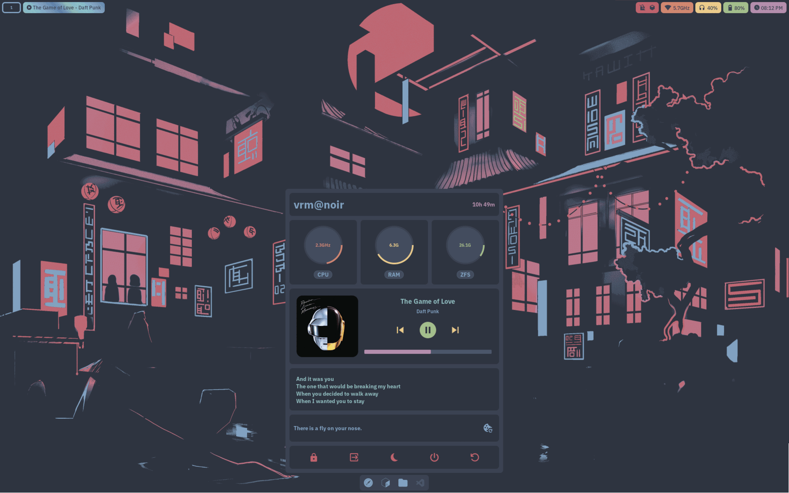

# NixOS Configuration Flake

~~slighly overengineered~~ NixOS configuration flake for multiple hosts.

Nix-specific features:

- completely reproducible, pure evaluation
- dotfiles managed using wrappers implemented from basic nixpkgs functions
- symlinks in ~ managed using [hjem](https://github.com/feel-co/hjem)
- secrets managed using [sops-nix](https://github.com/Mic92/sops-nix)
- secure boot using [lanzaboote](https://github.com/nix-community/lanzaboote)
- impermanence using zfs snapshots and bind mounts
- package management using [lix](https://lix.systems)
- android environment using
  [nix-on-droid](https://github.com/nix-community/nix-on-droid)
- nixos flake helper [cli](#nixos-flake-helper)
- flake enabled [images](#images)

See [Features](#features) for all features.

# Contents

1. [Features](#features)
2. [Setup & Usage](#setup-usage)
3. [Images](#images)
4. [nixos: Flake Helper](#nixos-flake-helper)

# Features

|                               |                                                          |
| ----------------------------- | -------------------------------------------------------- |
| distro                        | `NixOS`                                                  |
| packages                      | `nixos-unstable`                                         |
| android                       | `nix-on-droid`                                           |
| package manager               | `lix`                                                    |
| secrets                       | `sops-nix` `sops`                                        |
| ~ symlinks                    | `hjem`                                                   |
| dotfiles                      | `wrappers`                                               |
| bootloader                    | `systemd-boot` `uboot`                                   |
| secureboot                    | `lanzaboote`                                             |
| kernel                        | `linux-hardened`                                         |
| auditing                      | `auditd`                                                 |
| shell                         | `bash`                                                   |
| filesystem                    | `zfs`                                                    |
| networking                    | `wpa_supplicant`                                         |
| dns                           | `unbound`                                                |
| audio                         | `pipewire`                                               |
| web server                    | `nginx`                                                  |
| media server                  | `jellyfin`                                               |
| display server                | `wayland`                                                |
| compositor                    | `swayfx`                                                 |
| bar                           | `waybar`                                                 |
| widgets                       | `eww`                                                    |
| launcher                      | `rofi`                                                   |
| notifications                 | `dunst`                                                  |
| terminal emulator             | `foot`                                                   |
| file manager                  | `thunar`                                                 |
| pdf reader                    | `zathura`                                                |
| image viewer                  | `swayimg`                                                |
| media player                  | `mpv`                                                    |
| vector graphics editor        | `inkscape`                                               |
| browser                       | `brave`                                                  |
| homepage                      | [`homepage`](https://github.com/sotormd/homepage)        |
| search engine                 | `searxng`                                                |
| bittorrent                    | `qbittorrent-nox`                                        |
| anonymity                     | `i2pd` `oniux` `tor-browser`                             |
| passwords                     | `vaultwarden`                                            |
| text editor                   | [`neovim`](https://github.com/sotormd/neovim) `mousepad` |
| version control               | `git`                                                    |
| development                   | `rust` `python` `go` `haskell`                           |
| themes, icons, cursors, fonts | [`colors`](https://github.com/sotormd/colors)            |
| wallpapers                    | [`wallpapers`](https://github.com/sotormd/wallpapers)    |
| sandboxing                    | `firejail`                                               |
| virtualization                | `qemu` `virt-manager` `distrobox`                        |
| optimizations                 | `auto-cpufreq` `tlp` `powertop`                          |
| resource monitor              | `btop` `htop`                                            |
| clipboard                     | `cliphist`                                               |
| screenshots                   | `grimshot`                                               |

# Setup & Usage

1. `laptop` role: Laptop configuration

   [Docs](./docs/laptop.md)

2. `server` role: Headless home server configuration

   [Docs](./docs/server.md)

3. `droid` role: nix-on-droid configuration

   [Docs](./docs/droid.md)

# Images

Two images: `minimal` and `gnome` are included (for installation, recovery,
etc.)

These images have experimental features `flakes` and `nix-command` enabled.

See [images](./docs/images.md) for more details.

# `nixos` Flake Helper

Usage:

`$ nixos [command] [args]`

When run with **no command**, equivalent to:

`$ nixos tree -I .git -I .local --filesfirst`

When run with a command not listed below, the command is dispatched to
`$NIXOS_DIR`:

`$ nixos vi modules/common/firewall.nix`

## Commands

| Command             | `laptop` | `server` | Description                                                                                                     |
| ------------------- | -------- | -------- | --------------------------------------------------------------------------------------------------------------- |
| `test`              | ✔        | ✔        |  `$ nixos test`  Test the current configuration. Does **not** create a boot entry.                        |
| `switch`            | ✔        | ✔        |  `$ nixos switch`  Switch to the current configuration. Creates a boot entry.                             |
| `commit`            | ✔        | ✘        |  `$ nixos commit`  Switch to and commit the current configuration. Creates a boot entry and a Git commit. |
| `update`            | ✔        | ✔        |  `$ nixos update`  Update flake inputs in `flake.lock`.                                                   |
| `format`            | ✔        | ✔        |  `$ nixos format`  Format the flake using nixfmt.                                                         |
| `perms`             | ✔        | ✔        |  `$ nixos perms`  Apply correct permissions to all files in the flake.                                    |
| `purge`             | ✔        | ✔        |  `$ nixos purge`  Garbage collect old generations.                                                        |
| `repair`            | ✔        | ✔        |  `$ nixos repair`  Attempt to repair the nix store.                                                       |
| `edit <vars\|sops>` | ✔        | ✔        |  `$ nixos edit vars`  Edit variables file.   `$ nixos edit sops`  Edit sops-nix secrets.         |
| `serverpush <path>` | ✔        | ✘        |  `$ nixos serverpush /nixos`  Push the flake to `server:/nixos`.                                          |
| `help`              | ✔        | ✔        |  `$ nixos help`  Show this message and exit.                                                              |

See [scripts](./docs/scripts.md) for some detailed examples.
