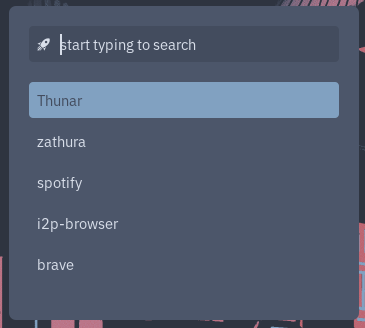

# Laptop Usage

This document covers using the Laptop role.

# Contents

1. [System Maintenance](#system-maintenance)
2. [Using the Sway desktop](#using-the-sway-desktop)
3. [Browsers](#browsers)
4. [Other Applications](#other-applications)
5. [Virtualisation and Containers](#virtualisation-and-containers)
6. [Specialisation Modes](#specialisation-modes)
7. [Bind Mounts and External Disks](#bind-mounts-and-external-disks)
8. [Services](#services)
9. [Using Selfhosted Features](#using-selfhosted-features)
10. [Development](#development)
11. [Further Reading](#further-reading)

# System Maintenance

## Routine Tasks

Routine tasks such as updating the flake, switching configurations,
garbage-collecting, and editing variables & secrets are handled through the
bespoke unified `nixos(1)` wrapper CLI.

Manpage:

```bash
man nixos
```

See [CLI Documentation](../cli.md) for the full command reference and workflow
examples.

## Variables and Secrets

The flake uses variables for device-specific configuration.

For example, using selfhosted services from a server and external drives can be
mounted via the variables file. To edit the variables file:

```bash
nixos edit vars
```

The flake uses secrets (via `sops`) for sensitive information.

For example, the hashed user password, the network PSK, etc. are configured via
`sops`. To edit the sops file:

```bash
nixos edit sops
```

# Using the Sway Desktop

This section covers using the Sway desktop.

## Logging In

Logging in to `tty1` as the main user will drop you into the `sway` desktop.

Logging in to `tty2` as the main user will drop you into a `cage` session with
the `foot` terminal.

Logging in to any other `tty` will drop you into the default shell, `bash`.

## Basic Motions

The basic motions are identical to the default `i3` / `sway` motions.

Note: `$mod` is `Mod4` (the `Super` / `Windows` key).

| Action                                           | Keybind                             |
| ------------------------------------------------ | ----------------------------------- |
| Focus left container                             | `$mod+Left` / `$mod+h`              |
| Focus right container                            | `$mod+Right` / `$mod+l`             |
| Focus up container                               | `$mod+Up` / `$mod+k`                |
| Focus down container                             | `$mod+Down` / `$mod+j`              |
| Move container left                              | `$mod+Shift+Left` / `$mod+Shift+h`  |
| Move container right                             | `$mod+Shift+Right` / `$mod+Shift+l` |
| Move container up                                | `$mod+Shift+Up` / `$mod+Shift+k`    |
| Move container down                              | `$mod+Shift+Down` / `$mod+Shift+j`  |
| Go to workspace `1..10`                          | `$mod+1..0`                         |
| Move container to workspace `1..10`              | `$mod+Shift+1..0`                   |
| Go to next workspace                             | `$mod+PgDown` / `$mod+ctrl+Right`   |
| Go to previous workspace                         | `$mod+PgUp`/ `$mod+ctrl+Left`       |
| Fetch containers from scratchpad                 | `$mod+Minus`                        |
| Move container to scratchpad                     | `$mod+Shift+Minus`                  |
| Toggle focus between floating / tiled containers | `$mod+Space`                        |
| Toggle floating / tiled                          | `$mod+Shift+Space`                  |
| Close current container                          | `$mod+Shift+q`                      |
| Split vertical                                   | `$mod+v`                            |
| Split horizontal                                 | `$mod+b`                            |
| Toggle split layout                              | `$mod+e`                            |
| Tabbed layout                                    | `$mod+w`                            |
| Stacking layout                                  | `$mod+s`                            |
| Fullscreen                                       | `$mod+f`                            |
| Focus parent                                     | `$mod+a`                            |

Workspaces can also be changed using the `rofi` launcher, see
[workspace switcher](#workspace-switcher).

## Launching Apps

| Action                 | Keybind       |
| ---------------------- | ------------- |
| Launch terminal `foot` | `$mod+Return` |
| Launch launcher `rofi` | `$mod+d`      |

The `rofi` launcher has several other uses, see:
[Launcher, rofi](#launcher-rofi)

## Additional Keybinds

| Action              | Keybind                                |
| ------------------- | -------------------------------------- |
| Play / Pause media  | `XF86AudioPlay` / `Copilot+]`          |
| Stop media          | `$mod+XF86AudioPlay` / `Copilot+alt+]` |
| Next media          | `XF86AudioNext` / `Copilot+\`          |
| Previous media      | `XF86AudioPrev` / `Copilot+[`          |
| Mute audio          | `XF86AudioMute`                        |
| Increase volume     | `XF86AudioRaiseVolume`                 |
| Decrease volume     | `XF86AudioLowerVolume`                 |
| Increase brightness | `XF86MonBrightnessUp`                  |
| Decrease brightness | `XF86MonBrightnessDown`                |
| Translucent window  | `$mod+t`                               |
| Opaque window       | `$mod+o`                               |

All media commands are dispatched via `playerctl`.

All audio commands are dispatched via `wpctl` and applied to the default sink.

All brightness commands are dispatched via `brightnessctl`.

The `volume` and `brightness` commands are wrappers which display a `dunst`
notification with a bar indicator.

The media and audio can also be controlled via waybar:

- Media: [playerctl Module](#playerctl-module)
- Audio: [audio Module](#audio-module)

## Modes

Return to normal mode from any other mode by using `Escape` / `Return`.

### Resize

Enter resize mode by using `$mod+r`

| Action        | Keybind       |
| ------------- | ------------- |
| shrink height | `Up` / `k`    |
| shrink width  | `Left` / `h`  |
| grow height   | `Down` / `j`  |
| grow width    | `Right` / `l` |

### Leave

Enter leave mode by using `$mod+Escape`

| Action   | Keybind |
| -------- | ------- |
| Lock     | `l`     |
| Logout   | `x`     |
| Suspend  | `s`     |
| Poweroff | `u`     |
| Reboot   | `r`     |

### Screenshot

Enter screenshot mode by using `$mod+PrintScreen`

| Action       | Keybind |
| ------------ | ------- |
| copy area    | `ca`    |
| save area    | `sa`    |
| copy window  | `cw`    |
| save window  | `sw`    |
| copy screen  | `cs`    |
| save screen  | `ss`    |
| color picker | `p`     |

You can also use `$mod+Shift+s` in normal mode to copy area.

All screenshot commands are dispatched via `grimshot`.

The color picker copies the hex code to the clipboard.

## Top panel, waybar

This section covers the Waybar top panel.

### workspaces Module


Shows workspaces.

| Action          | Bind       |
| --------------- | ---------- |
| Go to workspace | Left click |

Current workspace is highlighted in bold.

### mode Module

Shows current mode.

Nothing is shown for normal mode.

### title Module

Shows title of current container.

### idle_inhibitor Module


| Action                                      | Bind       |
| ------------------------------------------- | ---------- |
| Toggle inhibiting automatic session locking | Left click |

### network Module


Shows current connection status / band / ssid name.

| Action                  | Bind         |
| ----------------------- | ------------ |
| Toggle band / ssid view | Left click   |
| Reassociate             | Right click  |
| Disconnect              | Middle click |

### audio Module


Shows current volume.

| Action               | Bind        |
| -------------------- | ----------- |
| Toggle muting        | Left click  |
| Launch `pavucontrol` | Right click |
| Increase volume      | Scroll up   |
| Decrease volume      | Scroll down |

### battery Module


Shows current battery percentage / remaining time.

| Action                        | Bind       |
| ----------------------------- | ---------- |
| Toggle percentage / time view | Left click |

### clock Module


Shows current date and time.

| Action                       | Bind       |
| ---------------------------- | ---------- |
| Toggle between date and time | Left click |

## Launcher, rofi

This section covers the Rofi launcher.

### run

Launch using `$mod+d`.



### workspace switcher

Launch using `$mod+g` for focusing a workspace.

Launch using `$mod+Shift+g` for moving current container to a workspace.

### clipboard history

Launch using `$mod+c`.

Shows complete clipboard history using `cliphist`.

Select an item to copy it to the clipboard.

Clipboard history can be cleared using `$mod+Shift+c`

Along with the traditional keybinds, you can use `wl-copy` or `wl-paste` to add
things to / paste things from the clipboard.

## Wallpapers

The `nord.space` wallpaper from
[wallpapers](https://github.com/sotormd/wallpapers) is used for the desktop.

A random XKCD comic is used as the lockscreen wallpaper, with
[xkcd-wall](https://github.com/sotormd/xkcd-wall). The comic is refreshed after
every unlock. To manually refresh:

```bash
xkcd-refresh
```

The fallback wallpaper for the lockscreen is `nord.nixos` from
[wallpapers](https://github.com/sotormd/wallpapers).

## Colors & Theming

All colors and theming options are defined in
[colors](https://github.com/sotormd/colors).

By default, the Nord palette is used.

# Browsers

Two web browsers: Brave and I2P Browser are included.

| Name        | Based On | Description                 |
| ----------- | -------- | --------------------------- |
| Brave       | Brave    | Primary, hardened browser   |
| I2P Browser | Firefox  | Browser for the I2P network |

## Brave

### Launching

The Brave browser can be launched from the console:

```bash
brave
```

It can also be launched from [rofi](#launcher-rofi).

Because of how the sandbox is set up, Brave can only be launched once (to
prevent concurrent writes to the data directory). If Brave is launched again, a
notificiation informs the user that Brave is already running and suggests
opening a new tab/window instead.

### Configuration

Note that the `~/.config/BraveSoftware/Brave-Browser/` directory is persisted by
Impermanence so all state is persisted across reboots.

The included brave browser is heavily policied using Chromium enterprise
policies.

The policies include options to disable several anti-features, particularly
those related to crypto and web3.

The included brave browser also strips out any telemetry by setting initial
preferences and local state files.

For a full comprehensive list, see [Security](../security.md#brave).

### Extensions

The browser also comes with these extensions:

- uBlock Origin
- Darkreader
- Vimium

uBlock Origin is also configured further via chromium policies.

### Sandbox

Brave runs in a sandbox using bubblewrap and xdg-dbus-proxy. See
[Security](../security.md#brave) for more information.

## I2P Browser

The i2p-browser can be launched from the console:

```bash
i2p-browser
```

It can also be launched from [rofi](#launcher-rofi).

The I2P Browser is just the Firefox browser with several configuration settings
to allow browsing the I2P network, along with hardened policies and preferences.

The I2P Browser uses the I2P HTTP Proxy hosted on the Server.

The I2P Browser runs in a bubblewrap sandbox. See
[Security](../security.md#i2p-browser) for more information.

# Other Applications

All apps can be launched using [rofi](#launcher-rofi).

## foot

Terminal emulator for wayland.

Launch using `$mod+Return`

## Thunar

File manager from the XFCE desktop environment.

## mousepad

Text editor from the XFCE desktop environment.

## swayimg

Simple image viewer for wayland.

## mpv

Media player supporting a wide variety of file formats.

## zathura

PDF viewer with vim-like keybinds.

## Inkscape

Scalable vector graphics editor.

## pavucontrol

PulseAudio volume control.

Launch using waybar [audio](#audio-module) module.

# Virtualisation and Containers

Virtual machines and containers allow running isolated environments.

## Virtual Machines

Virtual machines can be created using QEMU/KVM through `virt-manager`.

To launch the Virtual Machine Manager:

```bash
virt-manager
```

It can also be launched from [rofi](#launcher-rofi).

Created virtual machines are persisted across reboots since `/var/lib/libvirt`
is persisted under the [Impermanence](../filesystems.md#impermanence)
configuration.

ZFS ZVOLs can also be used for virtual machine disks.

For example, to create a 1TB ZVOL:

```bash
sudo zfs create -o compression=zstd rpool/vms 
sudo zfs create -o volblocksize=16K -V 1T rpool/vms/solaris
```

ZVOLs are thin-provisioned by default, so the full size is not allocated at
creation. Space is consumed only as the VM writes data.

Using `16K` as the `volblocksize` is optimal for VM workloads. Using `zstd`
gives decent compression ratios.

Now you can use `/dev/zvol/rpool/vms/solaris` as the block device for your
virtual machines.

This way, you can manage snapshots using ZFS as well:

```bash
sudo zfs snapshot rpool/vms/solaris@snap1
sudo zfs rollback rpool/vms/solaris@snap1
```

## Distrobox

`distrobox` allows for using other distributions under rootless containers on
the NixOS host system.

Example: To create a new container using Debian Stable

```bash
distrobox create debian -i debian:stable
```

To enter this container:

```bash
distrobox enter debian
```

See the manpage for more information:

```bash
man distrobox
```

Created distroboxes are persisted across reboots since
`~/.local/share/containers` is persisted under the
[Impermanence](../filesystems.md#impermanence) configuration.

## Podman

Podman, a simple management tool for pods, containers and images is installed.

See the manpage for more information:

```bash
man podman
```

Podman is also used as the backend for Distrobox.

# Specialisation Modes

The following "modes" can be enabled on the Laptop role. Modes are implemented
using specialisations.

Modes are available only if Impermanence is enabled. This ensures that
mode-specific files do not persist across reboots.

The bespoke `nixos` CLI cannot be used within the modes.

## Roaming Mode

Roaming Mode refers to the `roaming` specialisation that sets up an environment
ideal for usage away from home, in unreliable conditions.

Notable changes from the default configuration:

- wpa_supplicant replaced by NetworkManager
- all selfhosted features are disabled

Roaming Mode can be used by booting into the `roaming` specialisation from the
boot menu.

## GNOME Mode

GNOME Mode refers to the `gnome` specialisation that sets up a full GNOME
desktop.

Notable changes from the default configuration:

- sway desktop replaced with GNOME
- librewolf browser is installed
- graphene-hardened malloc is not used
- wpa_supplicant replaced by NetworkManager
- all selfhosted features are disabled

GNOME Mode can be enabled using `vars.modes.gnome.enable` and used by booting
into the `gnome` specialisation from the boot menu.

# Bind Mounts and External Disks

The variables file can be used to create bind mounts, which can be used to put
files in expected data directories from external disks.

See [Additional Disks and Mounts](../filesystems.md#additional-disks-and-mounts)
for more information.

# Services

Only the SSH server is available.

## SSH Server

OpenSSH secure shell daemon with a hardened configuration. SSH is also required
for [seeding](../cli.md#build-remote-closures) the current machine.

### Enabling

Enabled using `vars.services.ssh.enable`.

### Ports

Open on LAN to the private CIDR defined by `vars.services.ssh.allow`:

1. `vars.services.ssh.port`

### Keys

Trusted public keys are defined in `vars.services.ssh.trusted-keys`.

Host keys are generated and stored under `/etc/ssh`.

### Access Control

Access control is enforced in the following places:

Clients must satisfy ALL of:

- in the private LAN CIDR defined by `vars.services.ssh.allow`, for nftables
  filtering on LAN
- public key in `vars.services.ssh.trusted-keys`, for OpenSSH authorization

### Example Variables Configuration

For `vars.services.ssh`

```nix
{
  enable = true;
  allow = "10.0.0.4/31"; # allow 10.0.0.4 and 10.0.0.5
  trusted-keys = [
    "ssh-ed25519 AAAAC3NzaC1lZDI1NTE5AAAAIM4BfT6bp+fl83TyrSFAerXpAq6AVmVlfUnfnPU3jHHY example@example"
    "ssh-ed25519 AAAAC3NzaC1lZDI1NTE5AAAAIH+iL2MFXNyxd3Hu6akfdOBeI6HYWE4R0LTBScTHCoyH example@example"
  ];
}
```

# Using Selfhosted Features

Note that services are exposed using on Server using WireGuard. WireGuard is
configured in the variables file under `vars.wireguard`.

Example configuration for Laptop (`10.20.0.2` on wireguard) with a single peer
Laptop (`10.20.0.1` on wireguard, `10.0.0.3` on LAN):

```nix
{
  # wireguard vpn
  wireguard = {

    # wireguard address
    address = "10.20.0.2";

    # wireguard port
    port = 51820;

    # wireguard peers
    peers = [
      {
        PublicKey = "dfk4SUxCbQQcR18XAkh3bGyrvOBd+nscYCZWiFUrkGA=";
        Endpoint = "10.0.0.3:51820";
        AllowedIPs = [ "10.20.0.1/32" ];
        PersistentKeepalive = 25;
      }
    ];

  };
}
```

The Laptop has to be declared as a peer on the Server as well. See
[Server Usage Documentation](../server/usage.md#wireguard).

The Laptop can be configured to use several selfhosted features from a Server
using the `vars.selfhosted.*` variables.

1. Unbound DNS resolver

   Set the `vars.wireless.resolver` to the Server WireGuard peer address.

1. SearXNG metasearch engine `vars.selfhosted.searxng`

   SearXNG instance to use for web search.

1. Vaultwarden password manager `vars.selfhosted.vaultwarden`

   Vaultwarden instance to use for the web vault.

1. I2PD i2p router `vars.selfhosted.i2pd`

   I2PD router to use for the webconsole and HTTP proxy (for i2p-browser). The
   HTTP proxy can be independently used with no further configuration.

1. qBittorrent bittorrent client `vars.selfhosted.qbt`

   qBittorrent instance to use for the webui.

# Development

## Neovim

Neovim is installed using
[this configuration](https://github.com/sotormd/neovim). It can be launched from
the terminal using any of the aliases:

```bash
neovim
```

```bash
vim
```

```bash
vi
```

## Git

Git is configured in the variables file under `vars.user.git`. This includes
options for signed commits.

Example usage:

```nix
{
  name = "example";
  email = "example@example";
  signing-key = "/home/example/.ssh/id_ed25519_example_git_sign.pub";
  allowed-signers = "/home/example/.ssh/git_allowed_signers";
}
```

The allowed-signers file should contents should be as git expects it. Example:

```
example ssh-ed25519 AAAAC3NzaC1lZDI1NTE5AAAAIIoZXCKsWoH1R2MCeLXRDxeDrRdRGuOHG92sArhmlkT2 example@example
```

## Language Toolchains

Although things like `cargo`, `rustc`, `go`, `ghc`, `ghci`, `stack`, `cabal`,
`gcc`, `python3` are all installed, `nix` should be preferred for development
via dev shells, etc.

# Further Reading

- [Security Features](../security.md)
- [Filesystem and Impermanence Documentation](../filesystems.md)
- [CLI Documentation](../cli.md)
