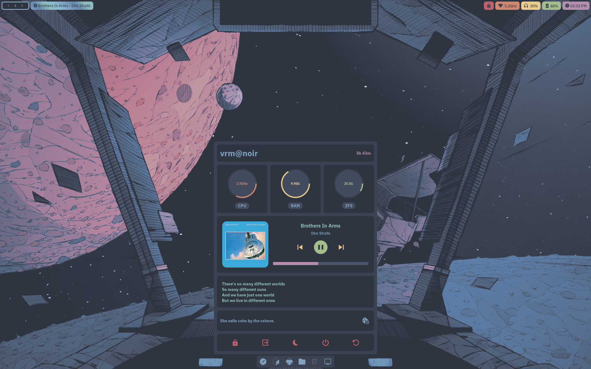
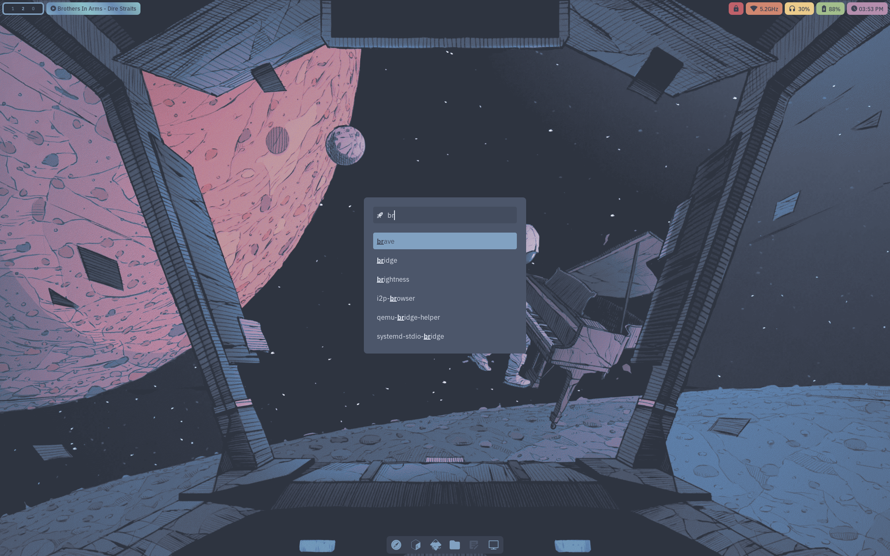
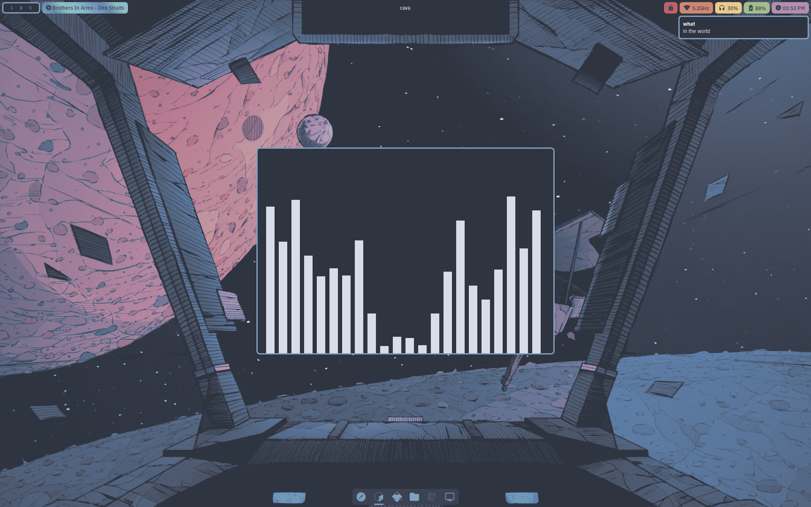
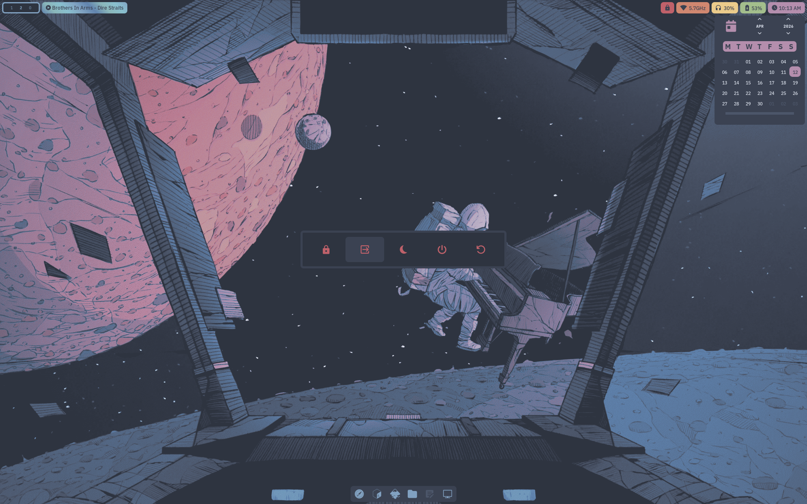
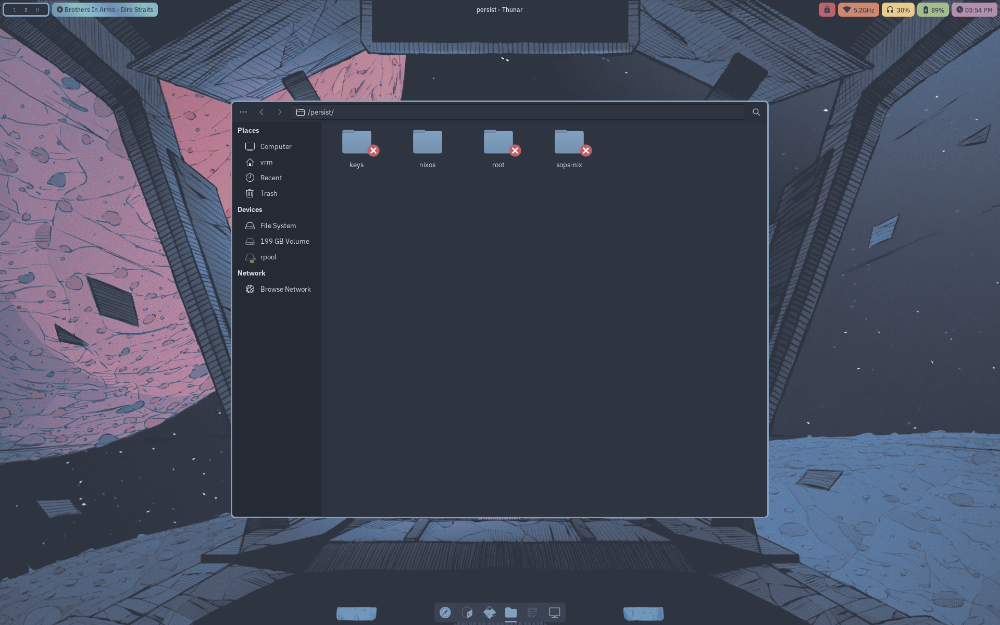
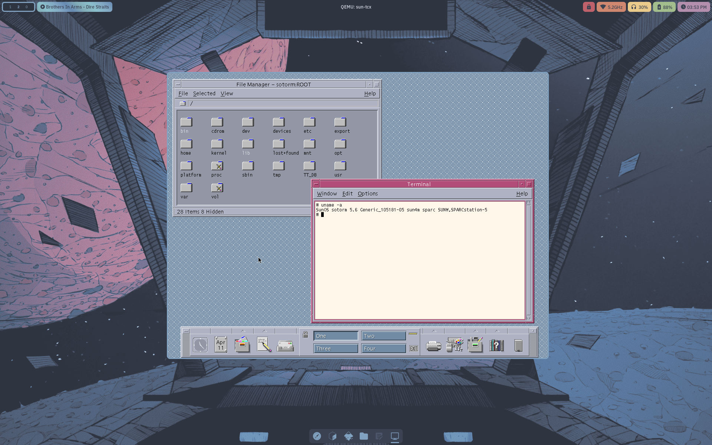
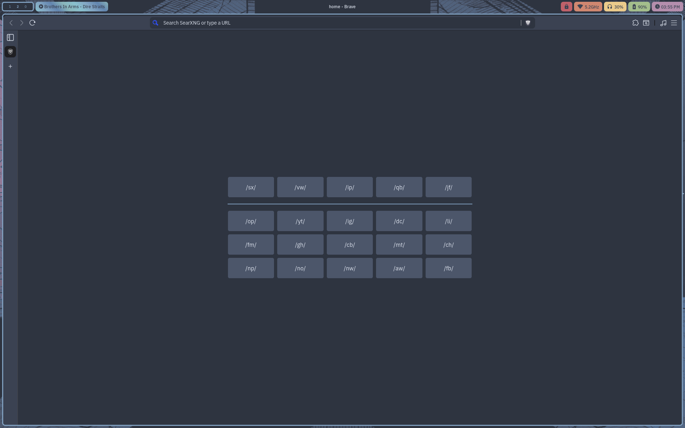
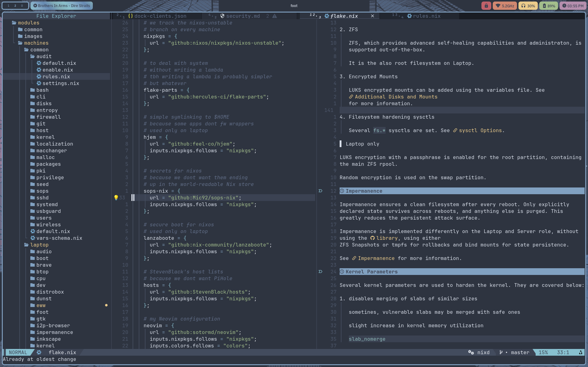

# Screenshots

Screenshots from the Laptop role!

> SwayFX compositor, Waybar panel, EWW dock and EWW dashboard

> Rofi launcher

> Cava visualizer, Foot terminal and Dunst notifications

> EWW calendar widget and EWW leave widget

> Thunar file manager

> Solaris 2.6 CDE running in QEMU

> Inkscape vector graphics editor

> Brave Browser and its homepage

> Neovim text editor

