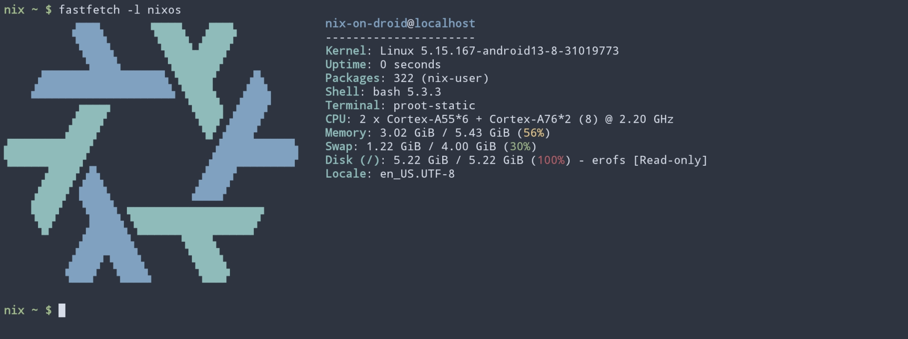

# `droid` Setup

[nix-on-droid](https://github.com/nix-community/nix-on-droid) configuration



# Contents

1. [Installing nix-on-droid](#1-installing-nix-on-droid)
2. [Applying configuration](#2-applying-configuration)
3. [Usage](#3-usage)

## 1. Installing nix-on-droid

1. Install [nix-on-droid](https://f-droid.org/packages/com.termux.nix/) from [FDroid](https://f-droid.org/)

2. When prompted, install with flake support.

## 2. Applying configuration

To rebuild the configuration for the first time:

```console
$ nix shell nixpkgs#git --command nix-on-droid switch --flake github:sotormd/nixos
```

## 3. Usage

Switch to the new configuration at `github:sotormd/nixos`:

```console
$ switch
```

Garbage collect:

```console
$ purge
```

