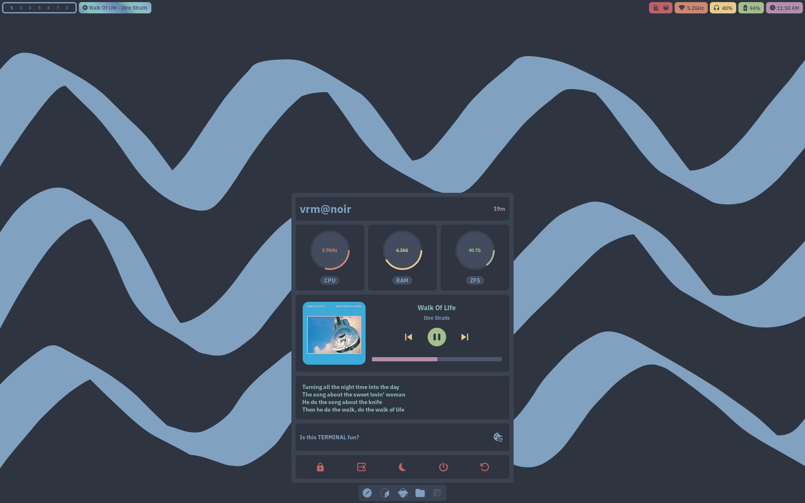
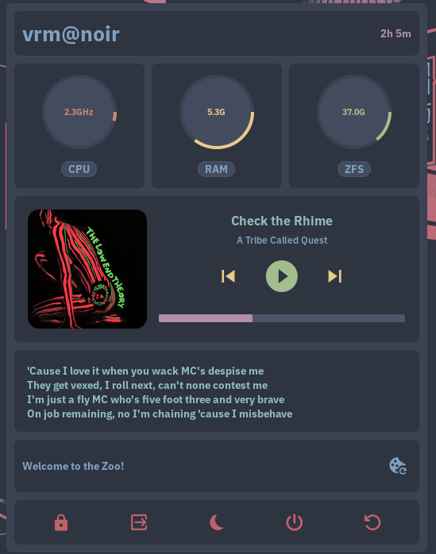
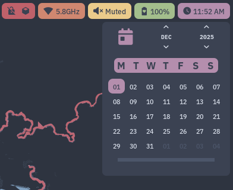
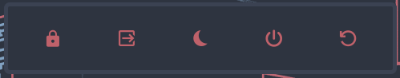

# `laptop` role

Personal laptop configuration.

# Contents

[Setup](#setup)

1. [Obtaining a Live NixOS Image](#obtaining-a-live-nixos-image)
2. [Preparing the Device](#preparing-the-device)
3. [Partitioning Disks](#partitioning-disks)
4. [Installing NixOS](#installing-nixos)
5. [Setting up Secure Boot](#setting-up-secure-boot)
6. [Setting up Impermanence](#setting-up-impermanence)

[Usage](#usage)

1. [System Maintenance](#system-maintenance)
2. [Using the Sway desktop](#using-the-sway-desktop)
3. [Adding External Disks](#adding-external-disks)
4. [Browsers](#browsers)
5. [Other Applications](#other-applications)
6. [Virtualisation & Containers](#virtualisation--containers)
7. [Nomad Mode](#nomad-mode)

[Security & Privacy](#security--privacy)

# Setup

Bootstrap process for the `laptop` role.

**The configuration expects a particular disk setup (covered below).**

Some other assumptions:

- `x86_64-linux` architecture
- AMD chipset
- No specific graphics requirements (eg. no NVIDIA)
- UEFI firmware
- Enough memory for ZFS (at least 8gb)
- Specific disk layout

Optional:

- Secure Boot support

## Obtaining a Live NixOS Image

1. Get a live NixOS image that has experimental features `flakes` and
   `nix-command` enabled, as well as all required packages for the init scripts.

   Two such images are included in this flake. To use the included GNOME image:

   ```bash
   nix run nixpkgs#nixos-generators -- \
   --format iso \
   --flake github:sotormd/nixos#image-gnome \
   -o /tmp/gnome-image
   ```

   The generated image will be available under `/tmp/gnome-image/iso/`.

   For more information, see [images.md](./images.md).

2. Write the generated image to a removable medium (eg. a usb stick) using `dd`
   or any equivalent tool.

## Preparing the Device

1. Disable secure boot for installation. It can be enabled later.

2. Boot into the live NixOS image.

3. Connect to the internet.

   ```bash
   nmtui
   ```

4. Ensure a working internet connection.

   ```bash
   ping archlinux.org
   ```

5. Set basic environment variables required by the installer.

   ```bash
   export NIXOS_ROLE=laptop
   export NIXOS_DIR=/persist/nixos
   export NIXOS_ROOT_MOUNT=/mnt
   ```

## Partitioning Disks

> **disko:** This flake doesn't use disko keeping dual booting in mind.

1. Create three partitions using `parted` or `gparted`.

   If creating a new partition table, use the `gpt` format.

   | Partition | Example Size    |
   | --------- | --------------- |
   | BOOT      | ~4G             |
   | SWAP      | ~8G             |
   | ROOT      | remaining space |

   Remember to mark the BOOT partition as ESP.

2. Assign variables to the partitions for ease of use.

   ```bash
   export BOOT=/dev/disk/by-partuuid/aaa...
   export SWAP=/dev/disk/by-partuuid/bbb...
   export ROOT=/dev/disk/by-partuuid/ccc...
   ```

   To find the partuuids:

   ```bash
   sudo blkid
   ```

3. Format and mount partitions for installation.

   ```bash
   export NIXOS_DISKS_DRY_RUN=false
   nix run github:sotormd/nixos -- init disks boot
   nix run github:sotormd/nixos -- init disks swap
   nix run github:sotormd/nixos -- init disks root
   nix run github:sotormd/nixos -- init disks mount
   ```

   Or alternatively, format and mount the partitions manually by following
   equivalent steps mentioned below.

<details>

<summary>Click to expand: manual steps</summary>

3. Format boot partition.

   ```bash
   sudo mkfs.vfat -F 32 -n BOOT $BOOT
   ```

4. Enable swap.

   ```bash
   sudo mkswap $SWAP
   sudo swapon $SWAP
   ```

5. Enable LUKS encryption.

   ```bash
   sudo cryptsetup luksFormat $ROOT
   sudo cryptsetup luksOpen $ROOT root
   ```

   The partition should be available at `/dev/mapper/root` now.

6. Create ZFS pools.

   ```bash
   sudo zpool create \
   -O compression=lz4 \
   -O xattr=sa \
   -O acltype=posixacl \
   -O atime=off \
   -O mountpoint=none \
   -o ashift=12 \
   rpool \
   /dev/mapper/root
   ```

   | Attribute   | Value    | Explanation                                                                                                |
   | ----------- | -------- | ---------------------------------------------------------------------------------------------------------- |
   | compression | lz4      | Enables **lz4** compression, which is fast and provides good compression ratios.                           |
   | xattr       | sa       | Stores extended attributes in system attribute space instead of hidden directories, improving performance. |
   | acltype     | posixacl | Enables **POSIX ACLs** for fine-grained permission control.                                                |
   | atime       | off      | Disables access time updates on files, which improves performance by reducing disk writes.                 |
   | mountpoint  | none     | Prevents automatic mounting of zpool, useful for NixOS.                                                    |
   | ashift      | 12       | Sets the sector size to **4K (2^12)**, optimal for modern storage devices (SSDs and advanced format HDDs). |

7. Create ZFS datasets.

   ```bash
   sudo zfs create rpool/root -o mountpoint=legacy
   sudo zfs create rpool/home -o mountpoint=legacy
   sudo zfs create rpool/nix -o mountpoint=legacy
   sudo zfs create rpool/persist -o mountpoint=legacy
   ```

8. Create a reserved dataset.

   ZFS's performance will deteriorate significantly when more than 80% of the
   available space is used - to avoid this, reserve disk space beforehand.

   ```bash
   sudo zfs create rpool/reserved -o refreservation=10G -o mountpoint=none
   ```

9. Create empty snapshots of `rpool/root` and `rpool/home` for impermanence.

   ```bash
   sudo zfs snapshot rpool/root@blank
   sudo zfs snapshot rpool/home@blank
   ```

10. Mount ZFS datasets.

    ```bash
    sudo mkdir -p /mnt && sudo mount rpool/root /mnt -t zfs
    sudo mkdir -p /mnt/home && sudo mount rpool/home /mnt/home -t zfs
    sudo mkdir -p /mnt/nix && sudo mount rpool/nix /mnt/nix -t zfs
    sudo mkdir -p /mnt/persist && sudo mount rpool/persist /mnt/persist -t zfs
    ```

11. Mount boot partition.

    ```bash
    sudo mkdir -p /mnt/boot && sudo mount $BOOT /mnt/boot
    ```

</details>

## Installing NixOS

1. Clone this flake.

   ```bash
   nix run github:sotormd/nixos -- init clone
   ```

   The flake will be cloned to `$NIXOS_ROOT_MOUNT$NIXOS_DIR`.

2. Initialize variables and secrets.

   ```bash
   nix run github:sotormd/nixos -- init vars
   nix run github:sotormd/nixos -- init sops
   ```

   Variables and secrets can be configured through environment variables while
   bootstrapping, see [this](#environment-variables) list for all available
   environment variables.

3. Edit variables and secrets.

   ```bash
   nix run github:sotormd/nixos -- init vars edit
   nix run github:sotormd/nixos -- init sops edit
   ```

   Make sure all variables and secrets are properly defined.

4. Install NixOS

   ```bash
   nix run github:sotormd/nixos -- init install
   ```

5. Finish installation.

   ```bash
   sudo reboot
   ```

   Remove the removable medium and boot into the newly installed NixOS
   installation.

   You should be able to log in to the sway desktop and use the `nixos` command.

### Environment variables

You _can_ set all variables and secrets while bootstrapping using these
environment variables.

This is useful if you have a `.env` file you wish to export environment
variables from.

Otherwise, it is simpler to edit the variables and secrets files like mentioned
in step 3.

<details>

<summary>Click to expand: full list of possible environment variables</summary>

| Name                              | Explanation                                        | Default                                           | Example                              |
| --------------------------------- | -------------------------------------------------- | ------------------------------------------------- | ------------------------------------ |
| `NIXOS_DIR`                       | Directory where the NixOS configuration is stored. | -                                                 | `"/persist/nixos"`                   |
| `NIXOS_ROLE`                      | `laptop` or `server` role                          | -                                                 | `"laptop"`                           |
| `VARS_DEVICE_HOSTNAME`            | Hostname of the device.                            | `$(uname -n)`                                     | `"Foo"`                              |
| `VARS_DEVICE_MACHINEID`           | `systemd` machine-id.                              | `$(cat /etc/machine-id)`                          | `"51934ba93b754bf28caf413f7e6c65bd"` |
| `VARS_DEVICE_HOSTID`              | Host ID, required for `ZFS`.                       | `$(head -c 8 /etc/machine-id)`                    | `"51934b"`                           |
| `VARS_DEVICE_BOOT`                | Boot partition partuuid.                           | `"$BOOT"`                                         | -                                    |
| `VARS_DEVICE_SWAP`                | Swap partition partuuid.                           | `"$SWAP"`                                         | -                                    |
| `VARS_DEVICE_ROOT`                | Root partition partuuid.                           | `"$ROOT"`                                         | -                                    |
| `VARS_DEVICE_SECUREBOOT_ENABLE`   | Enable secure boot.                                | `"false"`                                         | `"true"`                             |
| `VARS_DEVICE_IMPERMANENCE_ENABLE` | Enable impermanence.                               | `"false"`                                         | `"true"`                             |
| `VARS_DEVICE_PLYMOUTH_ENABLE`     | Enable `plymouth` boot animations.                 | `"false"`                                         | `"true"`                             |
| `VARS_DEVICE_AUTOCPUFREQ_ENABLE`  | Enable `auto-cpufreq`.                             | `"true"`                                          | `"false"`                            |
| `VARS_DEVICE_POWERTOP_ENABLE`     | Enable `powertop`.                                 | `"false"`                                         | `"true"`                             |
| `VARS_DEVICE_TLP_ENABLE`          | Enable `tlp`.                                      | `"false"`                                         | `"true"`                             |
| `VARS_USER_NAME`                  | Username.                                          | `$USER`                                           | `"Bar"`                              |
| `VARS_USER_EMAIL`                 | Email used for git commits.                        | `"$USER@nixos"`                                   | `"Bar@domain.com"`                   |
| `VARS_USER_GITHUB_KEYFILE`        | Github SSH identity key.                           | `"id_ed25519_github"`                             | `"id_rsa_github"`                    |
| `VARS_I18N_TIMEZONE`              | Timezone.                                          | `$(timedatectl show --property=Timezone --value)` | `"Europe/Berlin"`                    |
| `VARS_I18N_KEYBOARD`              | Keyboard layout.                                   | `"us"`                                            | `"us"`                               |
| `VARS_I18N_LOCALE`                | Locale.                                            | `"en_US.UTF-8"`                                   | `"de_DE.UTF-8"`                      |
| `VARS_NETWORK_INTERFACE`          | Wireless network interface.                        | `"wlp1s0"`                                        | `"wlan0"`                            |
| `VARS_NETWORK_SSID`               | Wireless network ssid.                             | `"net"`                                           | `"net20"`                            |
| `VARS_NETWORK_GATEWAY`            | Wireless network gateway.                          | `"192.168.0.1"`                                   | `"10.0.0.0"`                         |
| `VARS_NETWORK_IP`                 | Static local IP address.                           | `"192.168.0.100"`                                 | `"10.0.0.3"`                         |
| `VARS_NETWORK_WPA3_ENABLE`        | Enable SAE (dragonfly) authentication.             | `"true"`                                          | `"false"`                            |
| `VARS_NETWORK_SERVER_ENABLE`      | Enable server-dependant features.                  | `"false"`                                         | `"false"`                            |
| `VARS_NETWORK_SERVER_IP`          | Static local server IP address.                    | `"192.168.0.200"`                                 | `"10.0.0.5"`                         |
| `VARS_NETWORK_SERVER_DOMAIN`      | Server domain.                                     | `"nixos-server.duckdns.org"`                      | `"myserver.domain.com"`              |
| `VARS_NETWORK_SERVER_SSH_PORT`    | Server SSH port.                                   | `"22"`                                            | `"20000"`                            |
| `VARS_NETWORK_SERVER_SSH_KEYFILE` | Server SSH identity key.                           | `"id_ed25519_server"`                             | `"id_rsa"`                           |
| `VARS_NETWORK_SERVER_I2P_PORT`    | Server I2P HTTP proxy port.                        | `"4444"`                                          | `"23001"`                            |
| `VARS_OUTPUTS_LAPTOP`             | Identifier for laptop screen.                      | `"eDP-1"`                                         | `"eDP-1"`                            |
| `VARS_OUTPUTS_MONITOR`            | Identifier for monitor screen.                     | `"HDMI-A-1"`                                      | `"HDMI-A-1"`                         |
| `VARS_OUTPUTS_WALLPAPER`          | Wallpaper name.                                    | `"nord.space"`                                    | `"oc.nixos"`                         |
| `VARS_OUTPUTS_LOCKSCREEN`         | Lockscreen wallpaper name.                         | `"xkcd.random"`                                   | `"oc.nixos"`                         |
| `SECRETS_HASHED_PASSWORD`         | Hashed user password.                              | `$(mkpasswd -m yescrypt)`                         | -                                    |
| `SECRETS_PSK`                     | PSK for the network.                               | (user input)                                      | `"supersecretpsk"`                   |

Ensure all variables and secrets are properly defined.

</details>

## Setting up Secure Boot

> WARNING: Secure Boot for NixOS is under active development. Make sure you read
> lanzaboote documentation before proceeding.

> WARNING: If dual booting with Windows, either disable bitlocker encryption or
> keep the recovery keys handy.

1. System requirements.

   Ensure you have booted in UEFI mode and Secure Boot is supported.

   ```bash
   bootctl status
   ```

   Consider setting up a BIOS password if you haven't already.

2. Create secure boot keys.

   ```bash
   nixos init lanzaboote create
   ```

   Set `device.secureboot.enable = true;` in `vars.nix`.
   ```bash
   nixos edit vars
   ```

   Switch to the new configuration.
   ```bash
   nixos switch
   ```

   Verify `sbctl verify` output.

   ```bash
   sbctl verify
   ```
   It is expected that `bzImage.efi` files are not signed.

3. Enter Secure Boot setup mode in BIOS.

   Boot into EFI firmware and clear existing plaform keys (setup mode).

4. Boot into NixOS and enroll Secure Boot keys.

   ```bash
   nixos init lanzaboote enroll
   ```

5. Enable Secure Boot in BIOS.

   Boot into EFI firmware and enable Secure Boot.

   Boot into NixOS and Secure Boot should be activated and in user mode.

   ```bash
   bootctl status
   ```

## Setting up Impermanence

> This section assumes Secure Boot is set up and keys are available at
> `/var/lib/sbctl`.

1. Populate the `/persist/` directory.

   ```bash
   nixos init impermanence
   ```

2. Enable impermanence in configuration.

   Set `device.impermanence.enable = true;` in `vars.nix`.

   ```bash
   nixos edit vars
   ```

3. Switch to the new configuration.

   ```bash
   nixos switch
   ```

See [impermanence.md](./impermanence.md) for more information.

# Usage

Using the `laptop` role.

## System Maintenance

Routine tasks such as updating the flake, switching configurations,
garbage-collecting, repairing the Nix store, and editing variables & secrets are
handled through the unified `nixos(1)` helper CLI.

Manpage:

```bash
man nixos
```

Overview:

```bash
nixos help
```

See [scripts.md](./scripts.md) for the full command reference and workflow
examples.

## Using the Sway Desktop

The full sway config lives [here](../modules/laptop/sway/config.nix).



### Logging In

Logging in to `tty1` will drop you into the `sway` desktop.

This is possible due to this line in the login shell configuration:

```bash
if [ -z "$WAYLAND_DISPLAY" ] && [ -n "$XDG_VTNR" ] && [ "$XDG_VTNR" -eq 1 ]; then
    exec sway
fi
```

Logging in to any other `tty` will drop you into the default shell, `bash`.

### Basic Motions

The basic motions are identical to the default `i3` / `sway` motions.

Note: `$mod` is `Mod4` (the `Super` / `Windows` key).

| Action                                           | Keybind                             |
| ------------------------------------------------ | ----------------------------------- |
| Focus left container                             | `$mod+Left` / `$mod+h`              |
| Focus right container                            | `$mod+Right` / `$mod+l`             |
| Focus up container                               | `$mod+Up` / `$mod+k`                |
| Focus down container                             | `$mod+Down` / `$mod+j`              |
| Move container left                              | `$mod+Shift+Left` / `$mod+Shift+h`  |
| Move container right                             | `$mod+Shift+Right` / `$mod+Shift+l` |
| Move container up                                | `$mod+Shift+Up` / `$mod+Shift+k`    |
| Move container down                              | `$mod+Shift+Down` / `$mod+Shift+j`  |
| Go to workspace `1..10`                          | `$mod+1..0`                         |
| Move container to workspace `1..10`              | `$mod+Shift+1..0`                   |
| Go to next workspace                             | `$mod+PgDown`                       |
| Go to previous workspace                         | `$mod+PgUp`                         |
| Fetch containers from scratchpad                 | `$mod+Minus`                        |
| Move container to scratchpad                     | `$mod+Shift+Minus`                  |
| Toggle focus between floating / tiled containers | `$mod+Space`                        |
| Toggle floating / tiled                          | `$mod+Shift+Space`                  |
| Close current container                          | `$mod+Shift+q`                      |
| Split vertical                                   | `$mod+v`                            |
| Split horizontal                                 | `$mod+b`                            |
| Toggle split layout                              | `$mod+e`                            |
| Tabbed layout                                    | `$mod+w`                            |
| Stacking layout                                  | `$mod+s`                            |
| Fullscreen                                       | `$mod+f`                            |
| Focus parent                                     | `$mod+a`                            |

Workspaces can also be changed using the `rofi` launcher, see
[workspace switcher](#workspace-switcher).

### Launching Apps

| Action                 | Keybind          |
| ---------------------- | ---------------- |
| Launch terminal `foot` | `$mod+Return`    |
| Launch browser `brave` | `$mod+backslash` |
| Launch launcher `rofi` | `$mod+d`         |

The `rofi` launcher has several other uses, see:
[Launcher, rofi](#launcher-rofi)

### Additional Keybinds

| Action              | Keybind                 |
| ------------------- | ----------------------- |
| Play / Pause media  | `XF86AudioPlay`         |
| Stop media          | `$mod+XF86AudioPlay`    |
| Next media          | `XF86AudioNext`         |
| Previous media      | `XF86AudioPrev`         |
| Mute audio          | `XF86AudioMute`         |
| Increase volume     | `XF86AudioRaiseVolume`  |
| Decrease volume     | `XF86AudioLowerVolume`  |
| Increase brightness | `XF86MonBrightnessUp`   |
| Decrease brightness | `XF86MonBrightnessDown` |
| Translucent window  | `$mod+t`                |
| Opaque window       | `$mod+o`                |

All media commands are dispatched via `playerctl`.

All audio commands are dispatched via `wpctl` and applied to the default sink.

All brightness commands are dispatched via `brightnessctl`.

The `volume` and `brightness` commands are wrappers which display a `dunst`
notification with a bar indicator.

The media, audio and brightness can also be controlled via waybar:

- Media: [playerctl Module](#playerctl-module)
- Audio: [audio Module](#audio-module)
- Brightness: [battery Module](#battery-module)

### Modes

Return to normal mode from any other mode by using `Escape` / `Return`.

#### Resize

Enter resize mode by using `$mod+r`

| Action        | Keybind       |
| ------------- | ------------- |
| shrink height | `Up` / `k`    |
| shrink width  | `Left` / `h`  |
| grow height   | `Down` / `j`  |
| grow width    | `Right` / `l` |

#### Leave

Enter leave mode by using `$mod+Escape`

| Action   | Keybind |
| -------- | ------- |
| Lock     | `l`     |
| Logout   | `x`     |
| Suspend  | `s`     |
| Poweroff | `u`     |
| Reboot   | `r`     |

Entering leave mode also opens the eww [leave](#leave-widget) widget.

#### Screenshot

Enter screenshot mode by using `$mod+PrintScreen`

| Action       | Keybind |
| ------------ | ------- |
| copy area    | `ca`    |
| save area    | `sa`    |
| copy window  | `cw`    |
| save window  | `sw`    |
| copy screen  | `cs`    |
| save screen  | `ss`    |
| color picker | `p`     |

You can also use `$mod+Shift+s` in normal mode to copy area.

All screenshot commands are dispatched via `grimshot`.

The color picker copies the hex code to the clipboard.

### Top panel, waybar

The full waybar config lives [here](../modules/laptop/waybar/config.nix).

Styling options live [here](../modules/laptop/waybar/style.nix).

#### workspaces Module


Shows workspaces.

| Action          | Bind       |
| --------------- | ---------- |
| Go to workspace | Left click |

Current workspace is highlighted in bold.

#### playerctl Module


Shows currently playing track.

| Action           | Bind         |
| ---------------- | ------------ |
| Play / pause     | Left click   |
| Stop             | Middle click |
| Next             | Scroll up    |
| Previous         | Scroll down  |
| Toggle animation | Right click  |

#### mode Module

Shows current mode.

Nothing is shown for normal mode.

#### title Module

Shows title of current container.

#### idle_inhibitor Module


| Action                                      | Bind       |
| ------------------------------------------- | ---------- |
| Toggle inhibiting automatic session locking | Left click |

#### userns Module


| Action                                    | Bind       |
| ----------------------------------------- | ---------- |
| Toggle `kernel.unprivileged_userns_clone` | Left click |

#### network Module


Shows current connection status / band / ssid name.

| Action                  | Bind         |
| ----------------------- | ------------ |
| Toggle band / ssid view | Left click   |
| Reassociate             | Right click  |
| Disconnect              | Middle click |

#### audio Module


Shows current volume.

| Action               | Bind        |
| -------------------- | ----------- |
| Toggle muting        | Left click  |
| Launch `pavucontrol` | Right click |
| Increase volume      | Scroll up   |
| Decrease volume      | Scroll down |

#### battery Module


Shows current battery percentage / remaining time.

| Action                        | Bind        |
| ----------------------------- | ----------- |
| Toggle percentage / time view | Left click  |
| Increase brightness           | Scroll up   |
| Decrease brightness           | Scroll down |

#### clock Module


Shows current time.

| Action                                   | Bind       |
| ---------------------------------------- | ---------- |
| Open [calendar](#calendar-widget) widget | Left click |

### Widgets, eww

The full eww config lives [here](../modules/laptop/eww/config.nix).

Styling options live [here](../modules/laptop/eww/style.nix).

Scripts used in the widgets live [here](../modules/laptop/eww/scripts.nix).

#### Dock widget

Toggle dock visibility using `$mod+Tab`.


The icons represent apps. Each icon can have three states:

| State       | Icon Appearance     | Description              |
| ----------- | ------------------- | ------------------------ |
| `empty`     | Grey                | No window open           |
| `unfocused` | Blue                | At least one window open |
| `focused`   | Blue with underline | Currently focused window |

The following actions can be done on an `empty` icon:

| Action     | Bind       |
| ---------- | ---------- |
| Launch app | Left click |

The following actions can be done on an `unfocused` icon:

| Action                 | Bind       |
| ---------------------- | ---------- |
| Focus last used window | Left click |

The following actions can be done on a `focused` icon:

| Action                         | Bind         |
| ------------------------------ | ------------ |
| Toggle floating / tiled mode   | Left click   |
| Send to scratchpad             | Right click  |
| Close current window           | Middle click |
| Focus through all open windows | Scroll       |

The configuration for the dock, including pinned icons are defined
[here](../modules/laptop/eww/dock-clients.json).

Use the `eww-dock-init` command to reload the dock scripts.

#### Start widget

Toggle start widget visibility using `$mod+grave`.



Included modules:

- username
- hostname
- uptime
- cpu usage
- memory usage
- ZFS usage
- playerctl controls
- lyrics
- fortune
- leave commands

#### Calendar widget

Open by left clicking on the waybar [clock](#clock-module) module.



Use the arrows or scroll to change the month / year.

Current day is highlighted in purple.

Click on the purple calendar icon or use the `eww-cal-init` command to reload
calendar scripts.

#### Leave widget

The leave widget opens on entering [leave](#leave) mode.

The leave widget closes on returning to normal mode.



Instead of using the keybinds of leave mode, you can click on the buttons on
this widget instead.

### Launcher, rofi

The full rofi config lives [here](../modules/laptop/rofi/config.nix).

Styling options live [here](../modules/laptop/rofi/style.nix).

#### run

Launch using `$mod+d`.


#### workspace switcher

Launch using `$mod+g` for focusing a workspace.

Launch using `$mod+Shift+g` for moving current container to a workspace.

#### clipboard history

Launch using `$mod+c`.

Shows complete clipboard history using `cliphist`.

Select an item to copy it to the clipboard.

Along with the traditional keybinds, you can use `wl-copy` or `wl-paste` to add
things to / paste things from the clipboard.

### Wallpapers

To change the current wallpaper, change the `outputs.wallpaper` and
`outputs.lockscreen` variables in `vars.nix` .

```bash
nixos edit vars
```

Any wallpaper from [wallpapers](https://github.com/sotormd/wallpapers) can be
used.

For example to use `wallpapers/nord/building.png`, the variable should be set to
`"nord.building"`.

To use your own wallpapers, change the `wallpapers` input in
[flake.nix](../flake.nix) to a flake that exposes similar outputs.

The `output.lockscreen` can also be one of `xkcd.today` or `xkcd.random` for
xkcd comics.

See [xkcd-wall](https://github.com/sotormd/xkcd-wall) for more information.

### Colors & Theming

By default, the Nord palette is used.

All colors and theming options are defined in
[colors](https://github.com/sotormd/colors).

To use a different colorscheme, change the `colors` input in
[flake.nix](../flake.nix).

Examples:

| Colorscheme | Input URL                                              |
| ----------- | ------------------------------------------------------ |
| nord        | `github:sotormd/colors` / `github:sotormd/colors/nord` |
| gruvbox     | `github:sotormd/colors/gruvbox`                        |

To use your own colorscheme, change the input to a flake that exposes similar
outputs.

## Adding External Disks

External disks - whether **unencrypted**, **LUKS-encrypted**, or **requiring
hdparm tweaks** - can be configured declaratively through `vars.nix`.

Open the variables file:

```bash
nixos edit vars
```

All configuration happens under the `device.*` sections.

### Unencrypted Disks (device.mount)

Use `device.mount` to configure _plain, unencrypted_ filesystems.

Each attribute key is the mount point, and the value describes the underlying
block device.

#### Example

```nix
device.mount = {
  "/mnt/media" = {
    device = "/dev/disk/by-uuid/243fdae5-89df-4407-e6163e688f4d";
    fsType = "xfs";
    options = [ "defaults" ];
    neededForBoot = false;
  };

  "/mnt/backup" = {
    device = "/dev/disk/by-partuuid/1b2c3d4e-55ff-8899-aabb-ccddeeff0011";
    fsType = "ext4";
    options = [ "noatime" ];
    neededForBoot = false;
  };
};
```

These are translated directly into `fileSystems` entries during system
generation.

### LUKS-Encrypted Disks (device.luks)

Use `device.luks` to define encrypted volumes that unlock using a keyfile.

Each entry requires:

- `uuid` - LUKS container UUID (from `blkid` output)
- `keyfile` - path to keyfile
- `mount` - where the decrypted mapper device should mount
- `fs` - filesystem inside the LUKS container (`ext4`, `xfs`)

#### Example

```nix
device.luks = {
  ht02 = {
    uuid = "3f74d2e3-5a67-4b86-b2c3-842f39e45b7a";
    keyfile = "/root/keys/ht02";
    mount = "/mnt/ht02";
    fs = "xfs";
  };

  ht03 = {
    uuid = "5a67d2e3-842f-3f74-b2c3-4b8639e45b7a";
    keyfile = "/root/keys/ht03";
    mount = "/mnt/ht03";
    fs = "ext4";
  };
};
```

#### What happens automatically

For each entry:

1. A `/etc/crypttab` entry is generated:

   ```
   <name> UUID=<uuid> <keyfile> luks,nofail
   ```
2. The device unlocks to `/dev/mapper/<name>`
3. A filesystem entry is created:

   ```
   fileSystems."<mount>" = {
     device = "/dev/mapper/<name>";
     fsType = "<fs>";
   };
   ```

> Currently only `ext4` and `xfs` block devices are supported, use the
> `device.mount` options for anything else.

### hdparm Configuration (device.hdparm)

Use `device.hdparm` to disable aggressive head-parking or alter disk power
behavior for HDDs.

This accepts a **list of disk IDs** (as used in `/dev/disk/by-id`).

#### Example

```nix
device.hdparm = [
  "usb-WD_Elements_25A2_575852314134393745303255-0:0"
  "usb-Seagate_Expansion_1234567890ABCDEF-0:0"
];
```

#### What the system generates

One systemd service per disk:

```
hdparm-0.service
hdparm-1.service
...
```

Each service runs:

```
hdparm -B 254 -S 0 /dev/disk/by-id/<id>
```

This prevents aggressive head parking and increases drive longevity.

### Summary

| Feature               | Config Location | Description                              |
| --------------------- | --------------- | ---------------------------------------- |
| **Unencrypted mount** | `device.mount`  | Direct filesystem mounts                 |
| **Encrypted (LUKS)**  | `device.luks`   | Creates crypttab entries + mapper mounts |
| **hdparm tuning**     | `device.hdparm` | Generates systemd services per drive     |

## Browsers

Three web browsers: `brave`, `i2p-browser` and `vanilla-browser` are included.

| Name              | Browser  | Description                                          |
| ----------------- | -------- | ---------------------------------------------------- |
| `brave`           | Brave    | Primary, hardened browser                            |
| `i2p-browser`     | Firefox  | Browser for the I2P network                          |
| `vanilla-browser` | Chromium | Ephemeral vanilla browser with Windows 11 user agent |

### Brave

#### Launching

The Brave browser can be launched using the shortcut `$mod+backslash` or by
executing the firejail wrapper:

```bash
brave
```

#### Configuration

Note that the `~/.config/BraveSoftware/Brave-Browser/` directory is persisted by
impermanence so all state is persisted across reboots.

The included brave browser is heavily policied via chromium policies. The full
list of policies live [here](../modules/laptop/brave/policies.nix). The policies
include options to disable several anti-features, particularly those related to
crypto and web3.

The included brave browser also strips out any telemetry by setting initial
preferences and local state files. The initial preferences live
[here](../modules/laptop/brave/preferences.nix) and the local state lives
[here](../modules/laptop/brave/state.nix).

#### Extensions

The browser also comes with these
[extensions](../modules/laptop/brave/extensions.nix) to preserve privacy and
improve usability.

- uBlock Origin
- Darkreader
- Bitwarden
- Vimium

uBlock Origin is also configured further via chromium policies.

#### Sandbox

The `brave` executable provided is a firejail wrapper which uses `--nonewprivs`
to mitigate possible SUID vulnerabilities. All flags can be seen
[here](../modules/laptop/brave/firejail.nix).

Note that to run the brave browser, you will have to enable unprivileged user
namespaces, which is disabled by default. It can be enabled by setting the
`kernel.unprivileged_userns_clone` sysctl to `1` or via the waybar
[userns](#userns-module) module.

Using the brave browser without enabling unprivileged user namespaces is
possible, but requires a workaround. The brave browser uses the chromium
namespaces sandbox by default, you can check by visiting `brave://sandbox`. If
unprvileged user namespaces are disabled, then brave will fall back to using the
chromium SUID sandbox.

However, firejail doesn't allow using the chromium SUID sandbox from within a
firejail sandbox. So you must run brave outside of firejail. See
[here](../modules/laptop/brave/sandbox.nix) for instructions. This however is
not recommended unless you absolutely have to avoid unprivileged user
namespaces.

#### WebApps

The web app for `spotify` is also installed, and more web apps can be added
[here](../modules/laptop/brave/webapps.nix). The web apps also run under
firejail.

### i2p-browser

The i2p-browser can be launched by executing the firejail wrapper:

```bash
i2p-browser
```

The i2p-browser is just the Firefox browser with several configuration settings
to allow browsing the I2P network. The additional configuration options can be
found [here](../modules/laptop/i2p-browser/profile.nix) and policies
[here](../modules/laptop/i2p-browser/policies.nix).

The i2p-browser uses the I2P HTTP Proxy from `network.server.i2p.port` in
`vars.nix`.

The included `i2p-browser` executable is a firejail wrapper which uses
`--nonewprivs` to mitigate possible SUID vulnerabilities. All flags can be seen
[here](../modules/laptop/i2p-browser/firejail.nix).

### vanilla-browser

The vanilla-browser can be launched by executing the firejail wrapper:

```bash
vanilla-browser
```

The vanilla-browser runs in a `--private` firejail, all flags can be seen
[here](../modules/laptop/vanilla-browser/firejail.nix). This means that it can't
write to the user's home directory like Brave or i2p-browser.

The vanilla-browser also sets the user agent to show Windows 11.

It is not configured at all, and is mostly vanilla Chromium.

## Other Applications

### foot

Terminal emulator for wayland.

Launch using `$mod+Return`

### Thunar

File manager from the XFCE desktop environment.

### mousepad

Text editor from the XFCE desktop environment.

### swayimg

Simple image viewer for wayland.

### mpv

Media player supporting a wide variety of file formats.

### zathura

PDF viewer with vim-like keybinds.

### Inkscape

Scalable vector graphics editor.

### file-roller

Archive manager from the GNOME desktop environment.

## Virtualisation & Containers

Virtual machines can be created using QEMU/KVM through `virt-manager`.

`distrobox` allows for using other distributions under rootless containers on
the NixOS host system.

Notes:

- Created virtual machines and containers are lost on reboot, since impermanence
  does not persist these directories. To persist across reboots, store these
  under `/persist` or add these directories to the impermanence setup.
- `distrobox` requires the use of unprivileged user namespaces, which is
  disabled by default. It can be enabled by setting the
  `kernel.unprivileged_userns_clone` sysctl to `1` or via the waybar
  [userns](#userns-module) module.

An alternative to creating persistent VM disks is to use ZFS ZVOLs to store
them.

For example, to create a 1TB ZVOL:

```bash
sudo zfs create -o compression=zstd -o volblocksize=16K -V 1T rpool/vm-example-disk
```

ZVOLs are thin-provisioned by default, so the full size is not allocated at
creation. Space is consumed only as the VM writes data.

Using `16K` as the `volblocksize` is optimal for VM workloads. Using `zstd`
gives decent compression ratios.

Now you can use `/dev/zvol/rpool/vm-example-disk` as the block device for your
virtual machines.

This way, you can manage snapshots using ZFS as well:

```bash
sudo zfs snapshot rpool/vm-example-disk@snap1
sudo zfs rollback rpool/vm-example-disk@snap1
```

## Nomad Mode

Nomad Mode refers to the specialisation `nomad`, which sets up an environment
ideal for usage away from home, in unreliable conditions.

Notable changes from default `laptop` config:

- sway window manager replaced by full GNOME desktop environment
- wpa_supplicant replaced by NetworkManager
- unbound from `server` replaced by cloudflare DNS
- `kernel.unprivileged_userns_clone` set to 1 by default
- librewolf browser is installed
- flatpak is enabled, and flathub is added as a repo
- apps can be installed from GNOME software

Nomad Mode can be used by booting into the `nomad` specialisation from the boot
menu.

> Nomad Mode is available only if impermanence is enabled. This ensures that
> activity under Nomad Mode does not affect the standard system.

> **Does this clutter my device?** No, all GNOME-specific things (except some
> logs) are thrown out by impermanence.

The configuration for nomad mode is [here](../modules/laptop/modes/nomad.nix).

You can not use the `nixos` script from within the nomad specialisation.

# Security & Privacy

Several security and privacy oriented decisions were made while writing the
included modules.

This section is a non-exhaustive list of such decisions.

Note that several privacy features depend on the `server` role, so disabling
`network.server.enable` in the variables file will rob you of these benefits.

## Encryption

LUKS encryption with a passphrase is used on the root partition, as covered in
the [Partitioning Disks](#partitioning-disks) section.

Furthermore, LUKS encrypted external disks can be added easily. See
[Adding External Disks](#adding-external-disks).

Random encryption is also enabled for the swap partition.

## Secure Boot

Secure boot is enabled using the
[lanzaboote](https://github.com/nix-community/lanzaboote) project, ensuring that
only signed modules are loaded.

See the [Setting up Secure Boot](#setting-up-secure-boot) section for setup
instructions.

## Impermanence

The `laptop` role uses ZFS snapshots and bind mounts to ensure opt-in
persistance.

This ensures that only the required files and directories persist across
reboots.

This is accomplished by rolling back the `rpool/root` and `rpool/home` datasets
to their blank snapshots every boot.

See [impermanence.md](./impermanence.md) for more information.

The impermanence configuration, including the list of persisted directories can
be found [here](../modules/laptop/impermanence/).

## Kernel

The `linux-hardened` kernel is used.

Several [kernel parameters](../modules/common/boot/params.nix),
[sysctl options](../modules/common/boot/sysctl.nix) and
[module blacklists](../modules/common/boot/blacklist.nix) are put in place to
ensure better baseline security.

These options are heavily based on
[this](https://madaidans-insecurities.github.io/guides/linux-hardening.html)
article by Madaidan's Insecurities.

## Auditing

The Linux auditing subsystem is enabled and rules have been set, following some
reasonable STIGs.

The full list of rules can be found [here](../modules/common/audit/).

## Users

There is a single main user who is part of the `wheel` group.

The root account is disabled.

`sudo` is used to run commands as root.

The `sudo` configuration can be found [here](../modules/common/users/sudo.nix).

## Firewall

The NixOS firewall is used with all ports closed, and all interfaces untrusted
by default. This configuration can be found
[here](../modules/common/network/firewall.nix).

The firewall uses `iptables` (*`iptables-nft`) with the modern `nf_tables`
backend.

Only the `server` role has ports open, based on the running services. The server
configuration can be found [here](../modules/server/network/firewall.nix).

## Firejail

The firejail SUID sandbox is used to sandbox the [browsers](#browsers).

All the firejail wrappers are run with `--nonewprivs` to mitigate
vulnerabilities arising from firejail using SUID.

## Nix Package Manager

The Nix package manager is set to download only cryptographically signed
binaries.

Furthermore, only members of the `wheel` group can use the Nix package manager.

## Passwords & Secrets

The `laptop` role uses the Vaultwarden password manager (installed on the
`server` role) via the Bitwarden extension on the Brave Browser.

Secrets related to the NixOS system are stored securely by
[sops-nix](http://github.com/Mic92/sops-nix) using GPG keys.

To edit sops-nix secrets:

```bash
nixos edit sops
```

These secrets are available under `/run/secrets` after system activation and are
stored encrypted in the world-readable `/nix/store`.

These secrets are not tracked by git.

## DNS

The `laptop` role uses the Unbound DNS server installed on the `server` role.

The hardened DNS server configuration lives
[here](../modules/server/unbound/settings.nix).

The fallback DNS servers are Cloudflare's `1.1.1.1` and `1.0.0.1`.

## Search Engine

The `laptop` role uses the SearXNG metasearch engine installed on the `server`
role via the Brave Browser.

This preserves user privacy while ensuring good quality results.

The list of search engines that SearXNG uses by default live
[here](../modules/server/searxng/engines.nix).

The fallback search engine is `DuckDuckGo`.

## SSH

The ssh daemon is disabled on the `laptop` role.

On the `server` role, it uses a hardened configuration that lives
[here](../modules/server/ssh/).

The server ssh port that the laptop accesses is set in the variables file under
`network.server.ssh.port`.

## Anonymity

### I2P

The included `i2p-browser` allows users to browse the
[I2P](https://geti2p.net/en/) network.

The included bittorrent client on the `server` role, also uses the I2P network.

### Tor

The included `oniux` executable allows for kernel level tor isolation for any
linux app.

DO NOT use `oniux` to wrap browsers, use the `tor-browser` instead.

The `tor-browser` is not installed by default, but can be used by:

```bash
nix shell nixpkgs#tor-browser --command tor-browser
```
